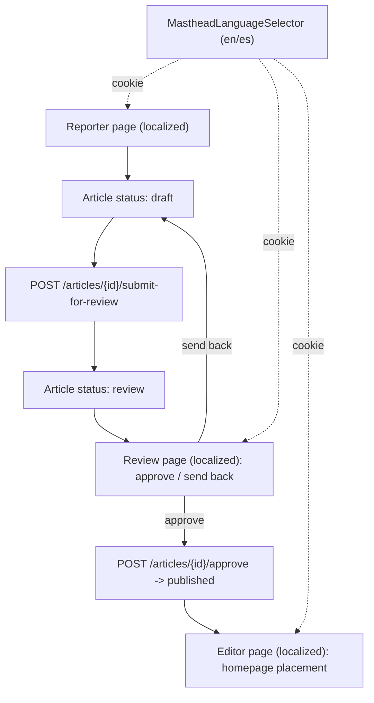

# Make Reporter / Editor / Review multilanguage-compliant

> Overview: Bring the admin editorial tooling (Reporter, Editor, and a new Review step) in line with the existing `next-intl` UI-string localization (`en`/`es`). Today these pages are hardcoded English and excluded from i18n. Article *content* stays single-language by design — this plan only localizes UI chrome/labels, and builds the missing Review workflow with localization baked in from the start.

## Audit result (does it follow the structure today?)

| Feature | Localized today? | Why / gap |
| --- | --- | --- |
| Public site | Yes | `next-intl`, `messages/{en,es}/*.json`, cookie-based, `localePrefix: 'never'` |
| Reporter (`/admin/reporter`) | **No** | Hardcoded English strings; uses no `useTranslations` |
| Editor (`/admin/editor`) | **No** | Hardcoded English strings; uses no `useTranslations` |
| Review | **N/A** | Workflow does not exist — `"review"` is a declared status literal nothing sets |

Conclusion: none of the three follow the multilanguage structure. This plan incorporates them.

## Key facts that make this low-risk

- The `(admin)` route group renders under root [`frontend/app/layout.tsx`](frontend/app/layout.tsx), which already wraps the tree in `NextIntlClientProvider` (via [`frontend/app/providers.tsx`](frontend/app/providers.tsx)) with the resolved locale + all messages. **`useTranslations` already works inside admin pages — they just don't call it.**
- The admin layout already renders the `Masthead`, which contains `MastheadLanguageSelector`, so an editor can already flip `en`/`es`.
- The `/admin` exclusion in [`frontend/middleware.ts`](frontend/middleware.ts) only skips locale *redirect* negotiation, which is moot under `localePrefix: 'never'`. **No middleware change required.**
- `ArticleStatusType` already includes `"review"` ([`backend/shared/shared/schemas/article_schemas.py`](backend/shared/shared/schemas/article_schemas.py), `backend/shared/shared/models/article.py`) and `PREVIEWABLE_STATUSES` already contains it ([`backend/shared/shared/read/article_reads.py`](backend/shared/shared/read/article_reads.py)). The status enum is ready; the transitions and UI are missing.

## Todos

- [ ] **admin-namespace**: Add `admin` to the `NAMESPACES` array in [`frontend/i18n/request.ts`](frontend/i18n/request.ts) and the `namespaces` array in [`frontend/scripts/validate-i18n.mjs`](frontend/scripts/validate-i18n.mjs)
- [ ] **admin-messages**: Create `frontend/messages/en/admin.json` and `frontend/messages/es/admin.json` with `reporter.*`, `editor.*`, `review.*`, and shared `workflow.*` keys (ICU placeholders, nested groups)
- [ ] **reporter-i18n**: Refactor [`frontend/app/(admin)/admin/reporter/page.tsx`](frontend/app/(admin)/admin/reporter/page.tsx) to read all UI strings via `useTranslations('admin')`
- [ ] **editor-i18n**: Refactor [`frontend/app/(admin)/admin/editor/page.tsx`](frontend/app/(admin)/admin/editor/page.tsx) + its child components to `useTranslations('admin')`; localize placement banner copy in `formatPlacementMessage` ([`frontend/hooks/use-editor-curation.ts`](frontend/hooks/use-editor-curation.ts))
- [ ] **workflow-nav-i18n**: Localize the workflow tab labels in [`frontend/lib/api/admin-routes.ts`](frontend/lib/api/admin-routes.ts) / [`frontend/components/ui/admin-workflow-nav.tsx`](frontend/components/ui/admin-workflow-nav.tsx) (move labels to message keys instead of literals)
- [ ] **review-backend**: Add `submit_for_review` (draft→review) and `approve` (review→published) transitions in [`backend/news_storage_app/news_storage_app/services/article_service.py`](backend/news_storage_app/news_storage_app/services/article_service.py) + router endpoints in [`backend/news_storage_app/news_storage_app/routers/articles.py`](backend/news_storage_app/news_storage_app/routers/articles.py), gated by role
- [ ] **review-frontend**: Add a `/admin/review` route + page listing `status == review` articles with approve / send-back actions, fully localized via `useTranslations('admin')`; register the tab in `ADMIN_WORKFLOW_TABS`
- [ ] **validate**: Run `npm run validate-i18n` (keys in sync across `en`/`es`) and resolve any missing/extra keys

## Flow



## Changes

### 1. Register the `admin` namespace

The request config currently loads exactly four namespaces; add the fifth so it's available app-wide (the existing pattern always loads all namespaces):

```5:5:frontend/i18n/request.ts
const NAMESPACES = ['common', 'navigation', 'home', 'auth'] as const
```

becomes `['common', 'navigation', 'home', 'auth', 'admin']`. Mirror the addition in `validate-i18n.mjs` line 8 (`const namespaces = [...]`), otherwise the validator won't check the new files.

### 2. Create the message files

`frontend/messages/en/admin.json` (and a translated `es` twin with identical keys). Suggested structure mirroring the existing nested + ICU conventions:

```json
{
  "workflow": { "reporter": "Reporter", "editor": "Editor", "review": "Review", "preview": "Preview" },
  "reporter": {
    "title": "Submit a story",
    "fields": { "headline": "Headline", "body": "Body", "categories": "Categories", "internationalPotential": "International potential" },
    "validation": { "headlineTooShort": "Headline must be at least {min} characters" },
    "actions": { "save": "Save draft", "submitForReview": "Submit for review" }
  },
  "editor": {
    "heading": "Homepage curation",
    "placement": { "staged": "Staged \"{title}\" in {slot} #{position}. Publish homepage to go live." }
  },
  "review": {
    "heading": "Stories awaiting review",
    "empty": "No stories are waiting for review.",
    "actions": { "approve": "Approve & publish", "sendBack": "Send back to reporter" },
    "status": { "approved": "Approved {title}", "sentBack": "Sent {title} back to draft" }
  }
}
```

Keys must be semantic (not English text), grouped, and identical across both locales (validator enforces this).

### 3. Localize Reporter

In [`frontend/app/(admin)/admin/reporter/page.tsx`](frontend/app/(admin)/admin/reporter/page.tsx): add `const t = useTranslations('admin')` and replace every literal label/placeholder/validation/button string with `t('reporter....')`. Use ICU args for the min-length messages (e.g. `t('reporter.validation.headlineTooShort', { min: 3 })`) instead of concatenation. Article `title`/`body` values the reporter types stay untouched — only the surrounding UI is localized.

### 4. Localize Editor

In [`frontend/app/(admin)/admin/editor/page.tsx`](frontend/app/(admin)/admin/editor/page.tsx) and its child components, route all literals through `useTranslations('admin')` under `editor.*`. For the staged-placement banner produced by `formatPlacementMessage` in [`frontend/hooks/use-editor-curation.ts`](frontend/hooks/use-editor-curation.ts), pass the translator (or a formatting callback) into the hook so the message uses `editor.placement.staged` with `{title}`, `{slot}`, `{position}` args rather than a built English string. Keep the cascade/placement *logic* untouched — this is a string-surface change only.

### 5. Localize the workflow nav

Tab labels are currently hardcoded in `ADMIN_WORKFLOW_TABS` ([`frontend/lib/api/admin-routes.ts`](frontend/lib/api/admin-routes.ts)). Move the label out of the data array (keep `href` there) and resolve labels in [`frontend/components/ui/admin-workflow-nav.tsx`](frontend/components/ui/admin-workflow-nav.tsx) via `t('workflow.<key>')`, so adding the Review tab stays consistent.

### 6. Build the Review workflow (backend)

In [`backend/news_storage_app/news_storage_app/services/article_service.py`](backend/news_storage_app/news_storage_app/services/article_service.py), add two transition methods alongside `publish`/`archive`:
- `submit_for_review(article_id)`: only valid from `draft` → sets `status = "review"`. Raise a custom exception (from `shared/core/exceptions.py`) on invalid source status.
- `approve(article_id)`: only valid from `review` → sets `status = "published"` (reuse existing publish side-effects).
- (optional) `send_back(article_id)`: `review` → `draft`.

Each method ≤30 lines, single responsibility, with a Google-style docstring. Add matching endpoints in [`backend/news_storage_app/news_storage_app/routers/articles.py`](backend/news_storage_app/news_storage_app/routers/articles.py):
- `POST /articles/{id}/submit-for-review` — gated so reporters (the author) can call it.
- `POST /articles/{id}/approve` and `POST /articles/{id}/send-back` — gated `require_role("editor", "admin")` (matching the existing publish/archive gates).

No schema change needed: `"review"` already exists in `ArticleStatusType` and `PREVIEWABLE_STATUSES`.

### 7. Build the Review page (frontend, localized)

- Add `/admin/review` to `ADMIN_WORKFLOW_ROUTES` / `ADMIN_WORKFLOW_TABS` ([`frontend/lib/api/admin-routes.ts`](frontend/lib/api/admin-routes.ts)) using the `workflow.review` label key.
- New page `frontend/app/(admin)/admin/review/page.tsx`: lists articles with `status == "review"` (filter the existing list endpoint), with Approve / Send-back buttons calling the new endpoints. All copy via `useTranslations('admin')` under `review.*`.
- Add REST client helpers for the new endpoints next to the existing article calls.

### 8. Validate

Run `npm run validate-i18n` and fix any reported missing/extra keys until it prints "in sync". This is the gate that proves the features now follow the multilanguage structure.

## Validation & QA

- Switching language in the masthead selector re-renders Reporter, Editor, and Review pages with `es` strings (and back to `en`); article body/title content is unchanged.
- `npm run validate-i18n` passes (en/es key parity for the new `admin` namespace).
- Reporter can submit a draft for review; article moves `draft → review`.
- Review page lists only `status == review` stories; Approve moves `review → published`; Send-back returns it to `draft`.
- Role gates: reporters can submit-for-review but cannot approve; editor/admin can approve/send-back.
- No regression in editor placement/cascade behavior (logic untouched, strings only).

## Out of scope (explicitly)

- **Per-article content translation** — article `title`/`body` remain single-language. No backend translation schema, no locale-keyed GraphQL args. (Confirmed.)
- Adding a third UI language — the namespace/registry seams support it later, but not part of this plan.
- A dedicated reviewer role distinct from `editor` — review actions reuse the existing `editor`/`admin` gate for now.
