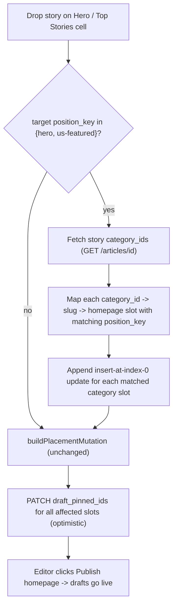

# Cascade hero to categories

> Overview: When an editor drags a story into the Hero or Top Stories slot, also pin it to the first slot of every category the story belongs to (from its category_ids), staged as a draft change like all other placements.

## Todos

- [ ] **hero-top-helper**: Add HERO_OR_TOP_STORIES_POSITION_KEYS + isHeroOrTopStoriesPositionKey to feed-layout.ts
- [ ] **cascade-builder**: Add appendCategoryCascadeUpdates helper in editor-placement.ts (insert at index 0 of each category slot, shift-down)
- [ ] **wire-drop**: In useHomepagePlacementEditor.applyDropPlacement, detect hero/top-stories, fetch story category_ids, map to category slots, and append cascade updates
- [ ] **category-map**: Provide category_id->slug map to the placement hook (pass categories from useEditorCuration to avoid duplicate fetch)
- [ ] **message**: Update formatPlacementMessage to report category cascade in the staged-change banner

## Goal

When a story is placed into **Hero** (`position_key: hero`) or **Top Stories** (`position_key: us-featured`) via drag-drop, automatically also insert it at the **top (index 0, shift others down)** of the homepage slot for each of the story's categories (`category_ids`). Staged as draft pins, published with the normal "Publish homepage" flow. One-directional only (no auto-removal).

## How the system works today (context)

- Hero / Top Stories / each category are all `Slot`s on the homepage layout. A category's slot has `position_key` == the category slug (e.g. `health`), seeded in [backend/admin_app/seed_dev.py](backend/admin_app/seed_dev.py).
- Drag-drop onto a canvas cell calls `applyDropPlacement` in [frontend/hooks/use-editor-curation.ts](frontend/hooks/use-editor-curation.ts) (~line 484), which builds a multi-slot patch via `buildPlacementMutation` in [frontend/lib/helpers/editor-placement.ts](frontend/lib/helpers/editor-placement.ts) and PATCHes each slot's `draft_pinned_ids`.
- `buildPlacementMutation` already removes the article from every slot it appears in, then inserts it at the target slot/index. Insert-at-top + shift-down semantics are exactly `insertPinnedIdAtIndex(base, articleId, 0, limit)` from [frontend/lib/helpers/pinned-ids.ts](frontend/lib/helpers/pinned-ids.ts).
- An article's categories are in `category_ids`, but editor story-pool rows (`IEditorStoryRow`) do not carry them. The detail endpoint `GET /articles/{id}` (`ArticleDetailOut`) does return `category_ids`. Categories (id -> slug) come from `getCategories()` ([frontend/lib/api/category-client.ts](frontend/lib/api/category-client.ts)).

This is a **frontend-only** change, consistent with the existing client-side mutation orchestration.

## Flow

## Changes

### 1. Helper to detect Hero / Top Stories target

In [frontend/lib/helpers/feed-layout.ts](frontend/lib/helpers/feed-layout.ts): add a constant `HERO_OR_TOP_STORIES_POSITION_KEYS = ['hero', 'us-featured']` and exported `isHeroOrTopStoriesPositionKey(positionKey: string): boolean` (mirrors the existing `isShiftDownPlacementPositionKey` at line 433). Note: do NOT reuse `isShiftDownPlacementPositionKey` since it also includes `more-top-stories`, which is out of scope.

### 2. Cascade augmentation in the mutation builder

In [frontend/lib/helpers/editor-placement.ts](frontend/lib/helpers/editor-placement.ts): add an exported helper `appendCategoryCascadeUpdates(result, slots, articleId, cascadeSlotIds)` that, for each cascade slot id, computes the slot's working base pinned ids (from an existing `result.updates` entry if present, otherwise `slotForEditorPlacement(slot).pinned_ids`), then sets/merges an update of `insertPinnedIdAtIndex(base, articleId, 0, resolveSlotPinnedLimit(slot))`. Returns a new `IPlacementMutationResult`. Keeping this separate leaves `buildPlacementMutation` untouched and respects the 30-line / options-object rules.

### 3. Resolve categories -> slot ids and wire into the drop handler

In [frontend/hooks/use-editor-curation.ts](frontend/hooks/use-editor-curation.ts), within `useHomepagePlacementEditor`:

- Load categories once (via `getCategories()` in a `useEffect`) to build a `category_id -> slug` map, OR accept categories as a hook param from `useEditorCuration` (which already loads them in `useArticleDetailEditor`). Prefer passing them in to avoid a duplicate fetch.
- In `applyDropPlacement` (~line 484): if `isHeroOrTopStoriesPositionKey(target.positionKey)`, fetch the dropped story's detail (`apiFetch<IArticleDetail>(\`${apiConfig.news}/articles/${articleId}\`)`) to read `category_ids`, map each to a slug, then find homepage slots whose `position_key` equals that slug (case-insensitive). Collect those slot ids (excluding the target slot itself). Build the base mutation, then run it through `appendCategoryCascadeUpdates` before calling `runPlacementMutation`.
- Categories with no homepage slot are skipped silently.

### 4. Messaging

Update `formatPlacementMessage` (~line 572) so the staged-change banner also reports the cascade, e.g. `Staged "<title>" in Hero #1 and pinned to the top of 2 category section(s). Publish homepage to go live.`

## Out of scope / notes

- One-directional only: removing a story from Hero/Top Stories does NOT remove it from category sections (per confirmation).
- No backend changes; category cascade is computed and staged entirely client-side, then published through the existing `publish-placements` flow.
- The drag source (News List story pool vs a card already on the canvas) does not matter; both route through `applyDropPlacement`, so both are covered.
