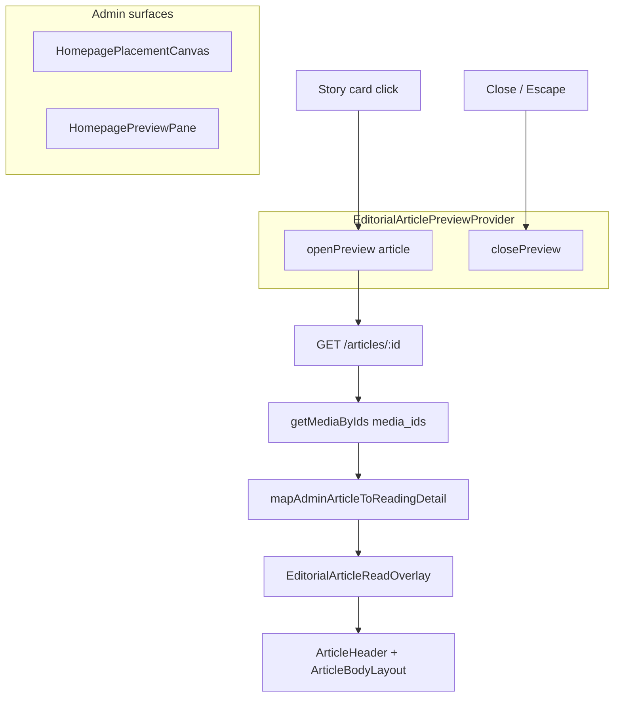

# Editor Article Read Preview Overlay

## Goal

When an editor clicks a story card on **Placement** ([`frontend/app/(admin)/admin/editor/placement/page.tsx`](frontend/app/(admin)/admin/editor/placement/page.tsx)) or **Preview** ([`frontend/app/(admin)/admin/preview/page.tsx`](frontend/app/(admin)/admin/preview/page.tsx)), open a **full-screen read-only overlay** showing the article exactly as a site visitor would see it, with a **Close** button (and Escape to dismiss). Editors remain on the current workflow page.

## Current constraints

- Story cards link to `/article/{slug}` via [`StoryCard`](frontend/components/ui/story-card.tsx).
- Placement **blocks all card clicks** in [`placement-overlay.tsx`](frontend/components/features/placement-overlay.tsx) (`onClickCapture` + `preventDefault`) so editors don't leave the canvas.
- Preview does not block clicks; navigating to the public article page fails for **unpublished** stories because GraphQL `articleBySlug` only returns `status: "published"` ([`article_reads.py`](backend/shared/shared/read/article_reads.py)).
- The canonical reading layout is already shared: [`ArticleHeader`](frontend/components/features/article-reading-view.tsx) + [`ArticleBodyLayout`](frontend/components/features/article-reading-view.tsx), used by [`ArticleClient`](frontend/app/[locale]/(site)/article/[slug]/ui.tsx).

## Architecture



## Implementation

### 1. Admin article fetch + mapper

Create [`frontend/lib/helpers/admin-article-reading.ts`](frontend/lib/helpers/admin-article-reading.ts):

- Define a narrow REST shape matching `ArticleDetailOut` (`author_name`, `media_ids`, `video_url`, `created_at`, etc.).
- `fetchAdminArticleForReading(articleId)`:
  - `GET ${apiConfig.news}/articles/${articleId}` via [`apiFetch`](frontend/lib/api/rest-client.ts)
  - Resolve media with `getMediaByIds` (same pattern as `loadArticleMedia` in [`use-editor-curation.ts`](frontend/hooks/use-editor-curation.ts))
  - Prepend legacy `video_url` as a lead video item when not already in resolved media (reuse `withLegacyLeadVideo` logic — extract to shared helper to avoid duplication)
  - Map to `IArticleDetail` (camelCase) with `storyUpdates: []` for v1
- Export a pure `mapAdminArticleDetailToReadingView()` for testability.

**Why admin API:** works for draft/review/published stories shown in the preview feed; public GraphQL cannot load unpublished slugs.

### 2. Preview context + hook

Create [`frontend/context/editorial-article-preview-context.tsx`](frontend/context/editorial-article-preview-context.tsx):

- State: `selectedArticle: IArticle | null`, `articleDetail: IArticleDetail | null`, `loading`, `error`
- `openPreview(article: IArticle)` — set selection, fetch detail, handle errors
- `closePreview()` — clear state
- `useEditorialArticlePreview()` — consumer hook (returns `openPreview`, `closePreview`, and overlay state)

### 3. Read overlay component

Create [`frontend/components/features/editorial-article-read-overlay.tsx`](frontend/components/features/editorial-article-read-overlay.tsx):

- Mirror modal shell from [`editor-article-modal.tsx`](frontend/components/features/editor-article-modal.tsx): `fixed inset-0 z-50`, `role="dialog"`, `aria-modal`, backdrop click to close, `useEscapeToClose`
- Sticky header with:
  - Optional status badge (draft/review) when `article.status !== 'published'`
  - **Close** button (primary action)
- Body: `site-container` width, loading/error states, then:

```tsx
<article>
  <ArticleHeader article={articleDetail} />
  <ArticleBodyLayout article={articleDetail} />
</article>
```

- **Out of scope v1:** `StoryFollowups` (admin detail does not return `storyUpdates`; can be added later if backend exposes them)

### 4. Wire click interception on story cards

Update [`frontend/components/ui/story-card.tsx`](frontend/components/ui/story-card.tsx):

- Add optional `onArticleClick?: (article: IArticle) => void` to `IStoryCardProps`
- When `onArticleClick` is set, render a `<button type="button">` (styled like the current `<Link>`) instead of navigating; call `onArticleClick(article)` on click
- When unset, keep existing `<Link href={storyHref(article)}>` behavior (public site unchanged)

Update [`frontend/components/ui/homepage-story-card.tsx`](frontend/components/ui/homepage-story-card.tsx):

- Read `openPreview` from `useEditorialArticlePreview()` when provider is present (nullable-safe: if no provider, pass `undefined`)
- Forward `onArticleClick={openPreview}` to `StoryCard`

### 5. Remove Placement click suppression; mount provider

Update [`frontend/components/features/placement-overlay.tsx`](frontend/components/features/placement-overlay.tsx):

- Remove blanket `onClickCapture` + `preventDefault` on `PlacementEditableCard` and `PlacementDropOnlyCard` — story card buttons will no longer navigate away; toolbar buttons already `stopPropagation`

Wrap both admin preview surfaces with provider + overlay:

- [`frontend/components/features/homepage-placement-canvas.tsx`](frontend/components/features/homepage-placement-canvas.tsx) — wrap `HomepageContent` in `EditorialArticlePreviewProvider`, render `EditorialArticleReadOverlay` as sibling
- [`frontend/components/features/homepage-preview-pane.tsx`](frontend/components/features/homepage-preview-pane.tsx) — same wrapping

### 6. i18n

Add keys to [`frontend/messages/en/admin.json`](frontend/messages/en/admin.json) and [`frontend/messages/es/admin.json`](frontend/messages/es/admin.json) under e.g. `preview.articleRead`:

- `close` / `closeAria`
- `loading`
- `loadError`
- `unpublishedBadge` (draft/review label)

## Files touched (summary)

| Action | File |
| ------ | ---- |
| New | `lib/helpers/admin-article-reading.ts` |
| New | `context/editorial-article-preview-context.tsx` |
| New | `components/features/editorial-article-read-overlay.tsx` |
| Edit | `components/ui/story-card.tsx` |
| Edit | `components/ui/homepage-story-card.tsx` |
| Edit | `components/features/placement-overlay.tsx` |
| Edit | `components/features/homepage-placement-canvas.tsx` |
| Edit | `components/features/homepage-preview-pane.tsx` |
| Edit | `messages/en/admin.json`, `messages/es/admin.json` |

## Validation

Manual checks:

1. **Placement** — click a published story: overlay opens with full article layout; Close and Escape return to canvas; move/remove toolbar still works on hover.
2. **Placement** — click a newly placed (unpublished) story: overlay loads via admin API and shows body + gallery.
3. **Preview** — same behavior on standalone preview page; no navigation to public `/article/...`.
4. **Public homepage** — story cards still link normally (no provider, no `onArticleClick`).
