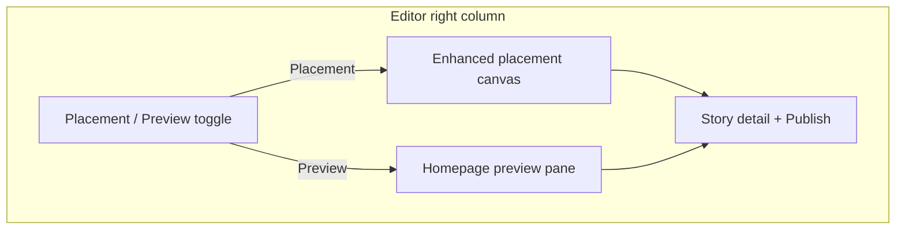
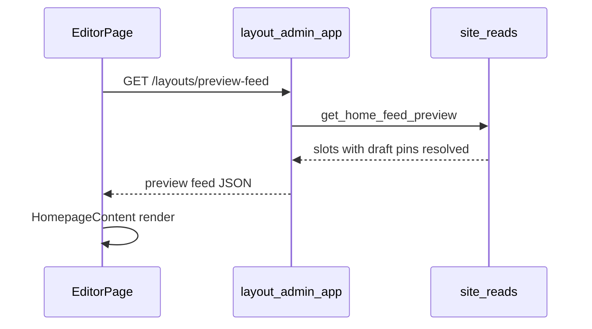

# Editor Canvas Preview (Placement + Homepage)

## Goal

Let editors preview homepage placement before publishing: an enhanced placement canvas with story thumbnails, plus a WYSIWYG homepage preview that includes draft stories in their pinned slots.

## Problem

Today the editor right column has two gaps:

1. **Placement canvas** ([`frontend/components/features/homepage-placement-canvas.tsx`](frontend/components/features/homepage-placement-canvas.tsx)) only shows text (`Occupied: {title}`), not how stories will look.
2. **Draft stories** can be pinned via `PATCH /slots/{id}`, but public feed resolution in [`backend/shared/shared/read/site_reads.py`](backend/shared/shared/read/site_reads.py) uses `list_published_by_ids`, so drafts never appear on the live homepage until **Publish** is clicked.

Editors need to see realistic placement and full homepage layout **before** publishing.

## Target UX



- **Placement mode**: keep drag-and-drop zones; show `HomepageStoryThumb` + title + draft badge in occupied cells.
- **Preview mode**: render the real homepage module stack (hero, bands, grids) using the same components as the public site, with draft pins visible.
- **Detail panel** (media curation + Publish) stays below the toggle in both modes.

---

## Implementation Approach

### 1) Backend: draft-inclusive preview feed

**Preview article resolver** — in [`backend/shared/shared/read/article_reads.py`](backend/shared/shared/read/article_reads.py), add `list_by_ids_for_preview`:

- Same ordered-id semantics as `list_published_by_ids`.
- Query filter: `status: {$in: ["draft", "review", "published"]}` (exclude `archived`).
- Keep `require_market=False` behavior for pinned editorial IDs.

**Preview slot resolution** — in [`backend/shared/shared/read/site_reads.py`](backend/shared/shared/read/site_reads.py):

- Extract shared pin+query-fill logic from `_resolve_slot_articles` into a helper that accepts a **pinned loader** callable.
- Add `_resolve_slot_articles_preview` that uses `list_by_ids_for_preview` for pinned IDs and keeps **published-only** query-fill (backfill slots should still reflect live content).
- Add `get_home_feed_preview(db, *, market_code, page_name="homepage", town=None)` mirroring `get_home_feed` but calling the preview resolver. **Do not use Redis cache.**

**REST endpoint** — in [`backend/layout_admin_app/layout_admin_app/routers/layouts.py`](backend/layout_admin_app/layout_admin_app/routers/layouts.py), add **before** `/{layout_id}` routes:

```
GET /layouts/preview-feed?market=us&page_name=homepage
```

- Auth: `require_role("editor", "admin")` (same as `/layouts/placements`).
- Returns the same JSON shape as `get_home_feed` (`layout_id`, `page_name`, `market_code`, `slots[]` with snake_case article fields).

**Tests** — extend [`backend/tests/test_read_layer.py`](backend/tests/test_read_layer.py):

- Pinned draft ID resolves in preview resolver.
- Pinned draft ID is **not** returned by existing `_resolve_slot_articles` (published path unchanged).
- Query-fill still uses published articles only.

### 2) Frontend: API client + feed mapping

In [`frontend/lib/api/layout-client.ts`](frontend/lib/api/layout-client.ts):

- Add `getHomepagePreviewFeed(marketCode?)` → `GET {layout}/layouts/preview-feed?market=...`
- Add a small REST mapper (or extend [`frontend/lib/graphql/mappers.ts`](frontend/lib/graphql/mappers.ts)) to convert snake_case preview payload → `IHomepageFeed` (reuse `mapArticle` field normalization).

### 3) Frontend: reusable homepage renderer

Refactor [`frontend/components/features/homepage.tsx`](frontend/components/features/homepage.tsx):

- Move slot-to-JSX rendering (hero, bands, sections, ads) into `HomepageContent({ feed }: { feed: IHomepageFeed })`.
- Keep exported `Homepage` as: `useFeed()` + `feedData = data ?? initialFeed` → `<HomepageContent feed={feedData} />`.

Create [`frontend/components/features/homepage-preview-pane.tsx`](frontend/components/features/homepage-preview-pane.tsx):

- Props: `feed: IHomepageFeed | null`, `loading`, `error`, optional `highlightArticleId`.
- Wrap content in a bordered, scrollable preview frame with a header: **“Homepage preview (includes unpublished stories)”**.
- Render `<HomepageContent feed={feed} />` when data is ready.
- Optionally add a subtle draft indicator on cards where `article.status !== 'published'` (minimum viable: header disclaimer + enhanced canvas badges).

### 4) Frontend: enhanced placement canvas

Update [`frontend/components/features/homepage-placement-canvas.tsx`](frontend/components/features/homepage-placement-canvas.tsx):

- Change prop from `articleTitleById: Map<string, string>` to `articleById: Map<string, IArticle>` (build from editor article rows via existing `articleRowToPreview` helper in [`frontend/components/features/editor-story-pool.tsx`](frontend/components/features/editor-story-pool.tsx) — extract to shared helper e.g. [`frontend/lib/helpers/editor-article-preview.ts`](frontend/lib/helpers/editor-article-preview.ts)).
- Occupied cells show:
  - `HomepageStoryThumb` (compact)
  - Truncated title
  - **Draft** badge when `status === 'draft'`
- Empty cells unchanged; drag-and-drop behavior unchanged.

### 5) Frontend: editor page toggle + data flow

Update [`frontend/app/(admin)/admin/editor/page.tsx`](frontend/app/(admin)/admin/editor/page.tsx):

- Add `panelMode: 'placement' | 'preview'` state and a segmented toggle above the right column.
- Build `articleById` map from loaded articles (+ selected detail).
- On **Preview** tab activation and after successful placement drop / media save:
  - Fetch `getHomepagePreviewFeed()`
  - Store in `previewFeed` state.
- Render:
  - `placement` → `<HomepagePlacementCanvas ... articleById={...} />`
  - `preview` → `<HomepagePreviewPane feed={previewFeed} loading={...} />`
- Keep existing detail panel below both modes.



---

## Deliverables

- [ ] `list_by_ids_for_preview` + `get_home_feed_preview` in shared read layer
- [ ] `GET /layouts/preview-feed` (editor auth) in layout_admin_app
- [ ] Read-layer tests for draft pin resolution in preview vs published paths
- [ ] `getHomepagePreviewFeed` + REST-to-`IHomepageFeed` mapper in layout-client
- [ ] `HomepageContent` extracted from homepage.tsx for reuse
- [ ] Enhanced `HomepagePlacementCanvas` with thumbnails and draft badges
- [ ] `HomepagePreviewPane` component
- [ ] Placement/Preview toggle and preview refresh wiring in editor page

## Out of scope (this phase)

- World-page preview canvas (placements API already tracks world, but editor only edits homepage today).
- Public `?preview=true` URL or iframe of the live site.
- Disabling article links in preview (links can remain; admin-only route).

## Manual test plan

1. Create/upload a **draft** story in Reporter.
2. In Editor, drag draft to Hero #1 — placement canvas shows thumbnail + Draft badge.
3. Switch to **Preview** — draft appears in hero block; surrounding published backfill slots still populate.
4. Click **Publish** — preview refreshes; draft badge disappears; public homepage (`/en`) shows the story after cache invalidation.
5. Verify non-editor users cannot call `GET /layouts/preview-feed` (401/403).
