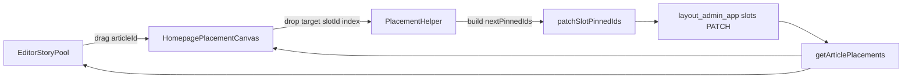

# Drag-and-Drop Homepage Placement Plan

## Goal

Replace index-based hero-only placement with a visual editor experience where an editor can drag a story onto named homepage card targets (hero lead, rails, bands, grids), then save confidently.

## Current Gaps To Fix

- Assignment UI in `[frontend/app/(admin)/admin/editor/page.tsx](frontend/app/(admin)/admin/editor/page.tsx)` only writes to hero with numeric index.
- Slot metadata needed for a visual picker is incomplete in REST responses (`display_name` and `presentation_type` are not fully surfaced from backend slot schemas/routes).
- Placement writes depend on client-side array math (`[frontend/lib/helpers/pinned-ids.ts](frontend/lib/helpers/pinned-ids.ts)`) instead of an editor-friendly interaction model.

## Implementation Approach

### 1) Define assignable homepage targets from slot metadata

- Build a frontend target catalog from homepage slots (`position_key`, `display_name`, `presentation_type`, `pinned_ids`).
- Reuse feed/presentation mapping from `[frontend/lib/helpers/feed-layout.ts](frontend/lib/helpers/feed-layout.ts)` and `[frontend/lib/presentation-registry.ts](frontend/lib/presentation-registry.ts)` to label human-friendly card zones.
- Introduce a lightweight `PlacementTarget` view model in editor-specific helpers (e.g., `frontend/lib/helpers/editor-placement-targets.ts`) so UI rendering is decoupled from raw API payloads.

### 2) Backend contract hardening for editor UX

- Extend slot output schemas/routes in `[backend/shared/shared/schemas/layout_schemas.py](backend/shared/shared/schemas/layout_schemas.py)` and `[backend/layout_admin_app/layout_admin_app/routers/slots.py](backend/layout_admin_app/layout_admin_app/routers/slots.py)` to reliably expose:
  - `display_name`
  - `presentation_type`
- Confirm slot service passthrough in `[backend/layout_admin_app/layout_admin_app/services/slot_service.py](backend/layout_admin_app/layout_admin_app/services/slot_service.py)` preserves those fields on reads/updates.
- Keep this phase compatible with current `PATCH /slots/{id}` write path (no mandatory new mutation endpoint in phase 1).

### 3) Build drag-and-drop placement canvas in editor page

- Split placement UI from `[frontend/app/(admin)/admin/editor/page.tsx](frontend/app/(admin)/admin/editor/page.tsx)` into focused components:
  - `EditorStoryPool` (left list/search/pagination)
  - `HomepagePlacementCanvas` (visual drop zones per slot/position)
  - `PlacementInspector` (selected card details/actions)
- Implement HTML5 drag-and-drop first (same pattern already used in reporter flow) to avoid dependency churn.
- Show each drop zone with clear label and occupancy state (empty/occupied), and surface existing article currently in that card location.

### 4) Apply placement updates safely

- On drop:
  - compute target `pinned_ids` from current slot state,
  - insert/move article in target index,
  - remove duplicate occurrence from same slot as needed,
  - call `patchSlotPinnedIds` in `[frontend/lib/api/layout-client.ts](frontend/lib/api/layout-client.ts)`.
- Keep `insertPinnedIdAtIndex` behavior but wrap in editor-specific helpers for move/replace semantics.
- Refresh placement map (`getArticlePlacements`) after successful update to keep list labels in sync.

### 5) UX safeguards and usability improvements

- Add optimistic UI with rollback on API failure.
- Add conflict prevention: disable drop when target slot is non-article content type.
- Add quick filters in story pool: `Unplaced`, `Homepage placed`, and `Search by title/slug`.
- Add explicit toast messages: "Placed in Politics #2", "Moved from Hero #3 to Top Stories #1".

### 6) Validation and rollout

- Unit tests for placement helper logic (`insert/move/remove` edge cases).
- Integration checks for editor page drag/drop -> patch payload correctness.
- Manual verification checklist: hero + non-hero slots, overwrite behavior, duplicate prevention, and refresh consistency.
- Ship behind a temporary editor feature flag so fallback numeric flow can remain until confidence is high.

## Data Flow (Phase 1)

## Deliverables

- Visual homepage placement canvas in editor workflow.
- Homepage-wide slot assignment (not hero-only).
- Backward-compatible backend schema exposure for slot labels/presentation.
- Test coverage for placement logic and critical admin interactions.
