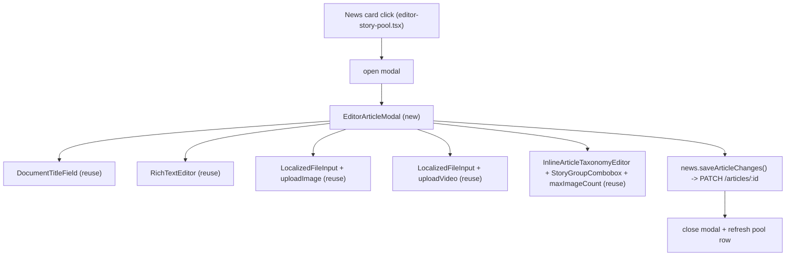

# Full popup news editor in the Editor section

## Goal

In the Editor News page, clicking a story currently reveals a cramped inline panel ([editor-article-detail-panel.tsx](frontend/components/features/editor-article-detail-panel.tsx)) that only edits taxonomy, story group, max-image-count, and image reorder. The user wants clicking a story to open a **complete popup editor** that can edit everything: title, body text (same rich editor the Reporter uses), add/remove pictures and videos, and every parameter.

Backend already supports this: `ArticleDetailOut` returns `title`, `body`, `video_url`, `media_ids`, etc., and `ArticleUpdate` (PATCH `/articles/{id}`) accepts `title`, `body`, `video_url`, `media_ids`, `thumbnail_url`, `max_image_count`, `category_ids`, `story_id`, `international_potential` (see [article_schemas.py](backend/shared/shared/schemas/article_schemas.py) lines 51-69, 86-98). So this is a **frontend-only** change.

## Architecture

## 1. Extend the detail editor hook

In [use-editor-curation.ts](frontend/hooks/use-editor-curation.ts):

- Extend `IArticleDetail` (lines 63-72) to include `body: string` and `video_url: string | null` (it already has `title`).
- In `useArticleDetailEditor` (lines 239-438) add new state: `title`, `setTitle`; `body`, `setBody`; `videoUrl`, `setVideoUrl`. Hydrate them in `loadArticleDetail` (lines 284-304) from the GET response.
- Add upload handlers reusing [media-client.ts](frontend/lib/api/media-client.ts): `uploadImages(files)` -> `uploadImage` per file, append `{ id, url }` to `mediaItems`; `uploadVideo(file)` -> set `videoUrl`; plus `removeVideo()`. Track an `uploadingMedia` flag to block save during uploads.
- In `saveArticleChanges` (lines 315-369) add `title: title.trim()`, `body`, and `video_url: videoUrl` to the PATCH body (lines 327-339). Add title/body length validation mirroring the Reporter (`MAX_TITLE_LENGTH`, `MIN_BODY_TEXT_LENGTH` from the reporter page). Note: PATCH drops `null`, so to clear a video send `video_url: ''` (confirm backend treats empty string as cleared; otherwise leave video-clear out of scope).
- Surface the new state/handlers through `useEditorNews()` (lines 977-1030) and the `IEditorNews` type.

## 2. New popup editor component

Create `frontend/components/features/editor-article-modal.tsx`:

- A controlled modal (`isOpen`, `onClose`) rendered as a fixed full-screen overlay with a scrollable centered card, focus trap, Escape-to-close, and a confirm-on-close when `isDirty`.
- Composes the reusable pieces:
  - `DocumentTitleField` ([document-title-field.tsx](frontend/components/ui/document-title-field.tsx)) for title.
  - `RichTextEditor` ([rich-text-editor.tsx](frontend/components/ui/rich-text-editor.tsx)) for body (HTML in/out), with toolbar labels built from `t('reporter.editor.*')`.
  - `LocalizedFileInput` ([localized-file-input.tsx](frontend/components/ui/localized-file-input.tsx)) `accept="image/*" multiple` for adding images, plus the existing `EditorMediaList` reorder/remove grid.
  - `LocalizedFileInput accept="video/*"` for video, with a preview + remove button.
  - Existing `InlineArticleTaxonomyEditor`, `StoryGroupCombobox`, and the max-image-count input (move these out of the old inline panel).
  - Footer with Save and conditional Publish (only when `detail.status === 'draft'`), wired to `news.saveArticleChanges()` / `news.publishSelected()`; close on successful save.

## 3. Wire click -> popup in the story pool

In [editor-story-pool.tsx](frontend/components/features/editor-story-pool.tsx):

- Keep the draggable card and `onSelect(article.id)` (preserves the drag-to-placement flow in [editor-split-windows.plan.md](.cursor/plans/editor-split-windows.plan.md)).
- Replace the inline `EditorArticleDetailPanel` render (lines 266-286) with opening the new `EditorArticleModal`. `onSelect` triggers `news.loadArticleDetail(id)` then opens the modal; render one `EditorArticleModal` for the selected article (driven by `selectedId`/`detail`), not one per card.
- Update the News page [news/page.tsx](<frontend/app/(admin)/admin/editor/news/page.tsx>) `handleSelect` (lines 101-158) and prop wiring to pass the new title/body/video state + upload handlers down, and to control modal open/close. Keep `useUnsavedChangesGuard(news.isDirty)`.

## 4. i18n

Add labels to [frontend/messages/en/admin.json](frontend/messages/en/admin.json) and [es/admin.json](frontend/messages/es/admin.json) under `editor.detail.*` for: title, body, add images, add video, remove video, modal heading, close. Reuse existing `reporter.editor.*` toolbar labels for the rich text toolbar (already localized).

## Unified media gallery (implemented)

Pictures and videos are managed together in ONE reorderable gallery (not separate
sections). Each `ILoadedMedia` carries `fileType: 'image' | 'video'`. "Add images"
and "Add videos" both append to `mediaItems`; every item has Up/Down/Remove and
renders by type (`` or `<video>`).

On save: `media_ids` = all id-bearing items in order; `video_url` = the first video
(lead video for cards/hero); thumbnail is derived by the backend from the first
image. The public `ArticleGallery` already renders every `media` asset whose
`fileType === 'video'` plus the lead `video_url`, so multiple videos display.

Backend change: `backend/news_storage_app/.../services/article_service.py` now caps
only IMAGE-type media against `max_image_count` (`_assert_image_cap` /
`_normalize_media_ids`), so videos can live in `media_ids` freely.

Legacy note: an old single `video_url` with no media id is surfaced as an id-less
gallery item and preserved via the derived lead `video_url`.

## Cleanup / out of scope

- `editor-article-detail-panel.tsx` deleted; its UI moved into the modal.
- Editing `market_ids`/`tags`/`status` directly is out of scope (status changes stay on publish/submit lifecycle endpoints).

## Open default decisions (chosen, adjust if needed)

- Clicking a card opens the full modal directly (no separate "Edit" button).
- The modal fully replaces the inline panel.
