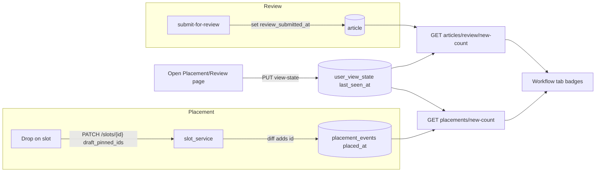

# Editor Placement Indicators and Multi-Field Search

## Goal

Two related editorial-workflow improvements, delivered as one phased effort:

1. **New-item indicators** - a count badge on the **Placement** and **Review** workflow tabs showing how many stories were newly placed / newly entered review since the current user last opened that tab. Backed by backend `placed_at` + per-user last-seen so it is accurate across devices; the badge auto-clears when the user opens the tab.
2. **Multi-field search** - backend-powered search/filter in the **editor** story pool and the **placement** story pool by created-date range, category, title, and news id. Fields combine with AND; news id is an exact match that overrides the other filters; the date filter is a created-date range (from/to).

## Decisions (confirmed)

- Surface: count badge on Placement and Review tabs.
- "New" tracking: backend `placed_at` (placement) + `review_submitted_at` (review) compared to a per-user last-seen.
- Clears: automatically when the user opens that view.
- Search location: editor pool and placement pool.
- Filtering: backend (extend `/search` + `ArticleOut`).
- Date: created-date range (from/to).
- Combine: AND; news id exact match overrides other filters.

## Key constraints discovered

- A placement is NOT a record - it is an article id inside a slot's `pinned_ids` / `draft_pinned_ids` array in [backend/shared/shared/models/layout.py](backend/shared/shared/models/layout.py). There is no `placed_at` today, so it must be captured.
- Search today is title/slug substring only via `GET /search?q=` in [backend/news_storage_app/news_storage_app/services/search_service.py](backend/news_storage_app/news_storage_app/services/search_service.py) (`_build_title_slug_filter`). List rows (`ArticleOut`) in [backend/shared/shared/schemas/article_schemas.py](backend/shared/shared/schemas/article_schemas.py) expose `created_at` but not `category_ids` or a review timestamp.

## Data flow

---

## Phase 1 - Backend: capture placement and review timestamps

- In [backend/layout_admin_app/layout_admin_app/routers/slots.py](backend/layout_admin_app/layout_admin_app/routers/slots.py) `PATCH /slots/{id}` (and the publish-placements path in `routers/layouts.py`), diff old vs new `draft_pinned_ids`/`pinned_ids`; for each newly added article id, upsert a `placement_events` record `{ article_id, slot_id, market_id, placed_at }`.
- In [backend/news_storage_app/news_storage_app/services/article_service.py](backend/news_storage_app/news_storage_app/services/article_service.py), set a new `review_submitted_at` field on transition into `review` (the `submit-for-review` path).
- Expose `review_submitted_at` on `ArticleOut` in [backend/shared/shared/schemas/article_schemas.py](backend/shared/shared/schemas/article_schemas.py).
- Add a `user_view_state` collection: `{ user_id, view, last_seen_at }`, `view in {placement, review}`.

## Phase 2 - Backend: badge and mark-seen endpoints

- `GET {layout}/placements/new-count` - count of `placement_events` with `placed_at > last_seen(user, placement)` within the user's market scope.
- `GET {news}/articles/review/new-count` - count of `status == review` articles with `review_submitted_at > last_seen(user, review)`.
- `PUT .../view-state/{view}` - set `last_seen_at = now` for the current user/view.

## Phase 3 - Frontend: workflow tab badges

- Add a `useWorkflowBadges()` hook fetching both counts (poll ~30s + refetch on window focus).
- Render counts as badges on the Placement and Review items in the workflow nav (`ADMIN_WORKFLOW_TABS` in [frontend/lib/api/admin-routes.ts](frontend/lib/api/admin-routes.ts) and the nav rendered in [frontend/app/(admin)/admin/layout.tsx](<frontend/app/(admin)/admin/layout.tsx>)).
- On mount of [frontend/app/(admin)/admin/editor/placement/page.tsx](<frontend/app/(admin)/admin/editor/placement/page.tsx>) and [frontend/app/(admin)/admin/review/page.tsx](<frontend/app/(admin)/admin/review/page.tsx>), call the mark-seen endpoint and locally zero the badge.

## Phase 4 - Backend: extend search

- Extend `GET {news}/search` ([backend/news_storage_app/news_storage_app/routers/search.py](backend/news_storage_app/news_storage_app/routers/search.py) + `search_service.py`) with params: `q` (existing), `category_id`, `created_from`, `created_to`, `article_id`.
- Logic: if `article_id` is present, return that single article and ignore the other filters (exact-id override). Otherwise build a Mongo `$and` of the existing title/slug regex, `category_id in category_ids`, and `created_at` between `created_from`/`created_to`; keep sort by `created_at` desc.
- Add `category_ids` to `ArticleOut` so the pool can display/confirm category.

## Phase 5 - Frontend: search filter UI

- Extend `buildSearchPageParams` + `searchArticles` in [frontend/hooks/use-editor-curation.ts](frontend/hooks/use-editor-curation.ts) to forward the new params; add `category_ids` to `IEditorStoryRow` in [frontend/components/features/editor-story-pool.tsx](frontend/components/features/editor-story-pool.tsx).
- Turn the existing single search box in `EditorStoryPool` into a compact filter bar: title input (existing), category dropdown (from `getCategories`), created from/to date pickers, news-id input, and a Clear button. When news id is filled, grey/disable the other filters to reflect the override.
- Apply the same filter bar to the placement-side pool (confirm whether the placement page reuses `EditorStoryPool` or a separate pool component, and wire there too).

## Phase 6 - i18n and validation

- Add badge tooltip/aria keys under `workflow` and filter keys (`category`, `dateFrom`, `dateTo`, `newsId`, `clear`, placeholders) under `editor.pool` in both [frontend/messages/en/admin.json](frontend/messages/en/admin.json) and [frontend/messages/es/admin.json](frontend/messages/es/admin.json).
- Validate: badge increments on a fresh placement/review submission and clears on opening the tab; search returns correct AND-combined results and exact-id override works across statuses.

## Open items to confirm before/while building

- "Placed" counts staged drops (`draft_pinned_ids`) as well as published placements (assumed yes - matches the current drag-and-drop flow).
- Authenticated user id source in the admin app for per-user last-seen.
- Whether news-id exact match should search across all statuses (assumed yes).
- Placement-side pool component identity (reused `EditorStoryPool` vs separate).
