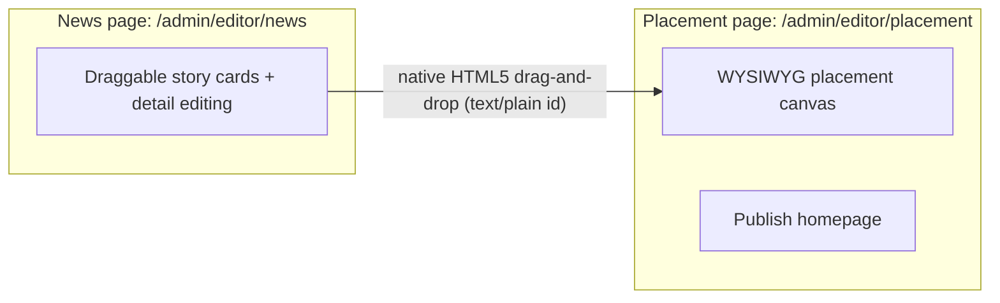

# Split Editor into independent News and Placement pages

## Goal

Turn the single cramped Editor route into two full-width, independent pages, each
with its own workflow nav tab:

- `/admin/editor/news` — News/Editor section ONLY: article pool + per-story detail editing. The placement canvas/preview column is removed from this page.
- `/admin/editor/placement` — new, standalone placement page (WYSIWYG canvas + preview + publish).

Two explicit requirements drive this split:

1. The front end MUST allow dragging-and-pasting a news story from the Editor (News page) onto the new Placement page. A News card is dragged out of the News page/window and dropped directly onto a Placement canvas slot to place the story.
2. The placement "share" currently embedded in the Editor page MUST be removed. Today `EditorWorkspaceColumn` (the right column rendering `HomepagePlacementCanvas` + preview) lives inside `frontend/app/(admin)/admin/editor/page.tsx` next to the story pool; it must no longer render on the Editor/News page and instead live only on the new Placement page.

The drag-and-paste uses native HTML5 drag-and-drop, which works across two
windows/tabs of the same browser (the dragged `text/plain` article id is readable
by the drop target in the other window). So there is no popup button, no "send to
placement" tray, and no `BroadcastChannel` transfer. Editor scope still stays in
sync across windows.

## Cross-window flow

## Routes

- Replace `frontend/app/(admin)/admin/editor/page.tsx` with a small client redirect to `/admin/editor/news` (mirrors existing `/admin/page.tsx` redirect pattern). This removes the current two-column layout where `EditorWorkspaceColumn` (the placement share) sat beside `EditorStoryPoolSection`.
- New `frontend/app/(admin)/admin/editor/news/page.tsx`: header, `EditorScopeSwitcher`, and the full-width story pool/detail UI ONLY (no `EditorWorkspaceColumn`/`HomepagePlacementCanvas`). Story cards keep their existing `draggable` + `onDragStart` that sets `dataTransfer.setData('text/plain', article.id)` so they can be dragged out to the Placement page. Uses a new `useEditorNews()` hook.
- New `frontend/app/(admin)/admin/editor/placement/page.tsx`: header, `EditorScopeSwitcher`, unpublished-placements banner + publish, and the placement/preview column (the `EditorWorkspaceColumn` content moved here). Canvas slots accept native drops of news cards dragged from the News page directly. Uses a new `useEditorPlacementBoard()` hook.
- `canAccessAdminPath` in `frontend/lib/api/admin-routes.ts` already allows `startsWith('/admin/editor')`, so sub-routes need no auth change.

## Hook split

Refactor `frontend/hooks/use-editor-curation.ts` to export two composable hooks built from the existing private sub-hooks (`useEditorArticlePool`, `useArticleDetailEditor`, `useHomepagePlacementEditor`) so logic is reused, not duplicated:

- `useEditorNews()`: pool + detail editor + `loadArticlePlacements` (needed for each card's placement "location" and the "New" tab). Initial load = pool + article placements.
- `useEditorPlacementBoard()`: homepage slots, placement targets, placements, drop/remove/move, publish, plus the preview feed wiring currently in `EditorWorkspaceColumn`. Initial load = slots + placements + preview.
- For `applyDropPlacement` auto-publish of fresh reporter drafts (keyed off `REPORTER_UPLOAD_STATUS`), the placement board fetches the dropped story's detail once to read its status. Article titles for placement banners come from a ref-backed title map seeded by that same fetch, falling back to the article id.

## Drag-and-paste from Editor to Placement page

This is the core requirement: a news story is dragged from the Editor (News page)
and pasted/dropped onto the Placement page. No transfer module is needed. The News
card's existing `onDragStart` in `frontend/components/features/editor-story-pool.tsx`
already sets `dataTransfer.setData('text/plain', article.id)`, and the Placement
canvas drop targets (`frontend/components/features/placement-overlay.tsx`) already
read `event.dataTransfer.getData('text/plain')` on drop. Because native HTML5 DnD
works across two windows/tabs of the same browser, dragging a News card onto a
canvas slot on the open Placement page places the story directly — even though the
two are now separate routes.

Since the dragged card is id-only, `useEditorPlacementBoard().applyDropPlacement`
fetches the dropped article's detail once to resolve its title (for the staged
placement banner) and status (to auto-publish freshly placed reporter drafts).

## Scope sync across windows

Extend `frontend/context/editor-scope-context.tsx` to persist scope to `localStorage` on change, initialize from it when present, and update on `BroadcastChannel`/`storage` events so both windows always target the same market/page.

## Nav + i18n

- Give News and Placement their own workflow tabs: in `ADMIN_WORKFLOW_ROUTES`/`ADMIN_WORKFLOW_TABS` (`frontend/lib/api/admin-routes.ts`) add `'/admin/editor/news'` (label `news`) and `'/admin/editor/placement'` (label `placement`), each with its own `activePrefix`.
- Add `workflow.news` / `workflow.placement` nav labels to `frontend/messages/{en,es}/admin.json`; update the News/Placement page subtitles to describe the drag-and-drop flow.

## Space

Each section now owns a full-width page: the News pool grid can widen (e.g. `sm:grid-cols-2` -> `xl:grid-cols-3`), and the placement canvas/preview span the full width instead of a ~1fr column.

## Out of scope

Reporter and Review remain their own existing routes (unchanged). Per-role access restrictions are deferred (structure is left ready for them).

## Todos

1. ~~transfer-lib~~ — Not needed: native HTML5 DnD crosses browser windows, so there is no BroadcastChannel/tray transfer.
2. **scope-sync** — Extend `editor-scope-context.tsx` to persist scope to localStorage and sync across windows via BroadcastChannel/storage events.
3. **hook-split** — Refactor `use-editor-curation.ts` to export `useEditorNews()` and `useEditorPlacementBoard()` composed from existing sub-hooks; resolve drop status/title via a single detail fetch on drop.
4. **news-route** — Create `/admin/editor/news/page.tsx` (pool + detail editing + id loader, draggable cards) using `useEditorNews()`. Do NOT include `EditorWorkspaceColumn`/`HomepagePlacementCanvas` here — the placement share is removed from the Editor/News page.
5. **placement-route** — Create `/admin/editor/placement/page.tsx` (banner+publish, scope switcher, placement/preview column moved out of the Editor page; canvas accepts news cards dragged-and-pasted from the News page) using `useEditorPlacementBoard()`.
6. **editor-redirect** — Replace `/admin/editor/page.tsx` (currently the two-column News + placement layout) with a client redirect to `/admin/editor/news`, removing the embedded placement share.
7. ~~tray-component~~ — Removed: no incoming-stories tray; the canvas accepts native cross-window drops directly.
8. ~~send-button~~ — Removed: cards are dragged onto the canvas, no "Send to placement" button.
9. **nav-route** — Add independent `News` and `Placement` workflow tabs in `admin-routes.ts`.
10. **i18n** — Add `workflow.news`/`workflow.placement` labels (en + es) and update News/Placement subtitles.
