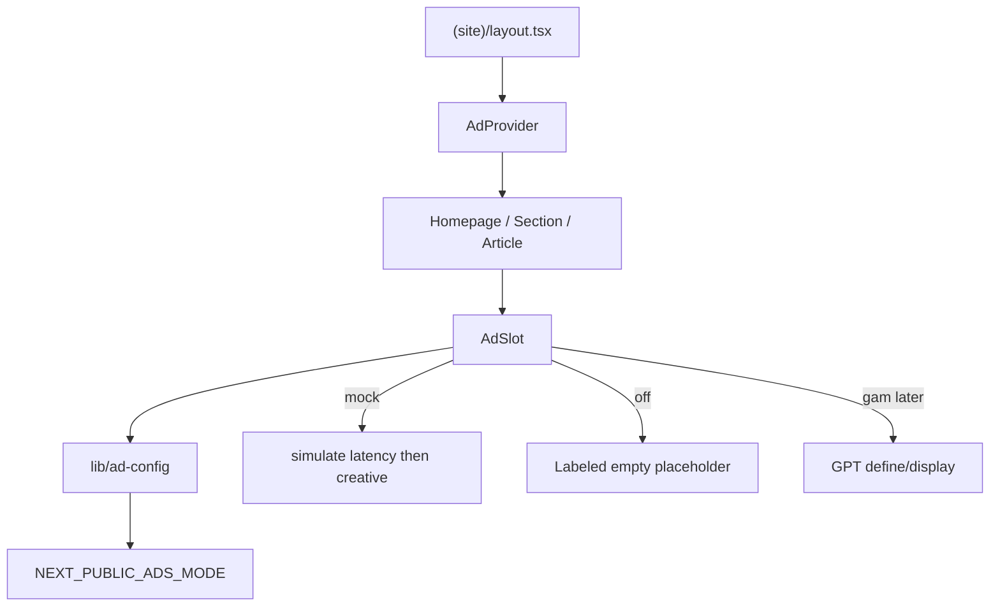

# Google Ad Manager Rollout

## Goal

Introduce a reusable public-site ad slot system that can simulate received creatives without a Google Ad Manager account, then later swap the same slots to real GPT delivery when the account is ready. Preserve existing editorial placement rules.

**Immediate scope (this iteration)**
- Public website only (`(site)` route group)
- All existing public ad placeholders
- Mock mode with fake sponsored creatives (brand/color/CTA)
- No GPT scripts, no GAM network activation

**Later scope (unchanged)**
- Real GAM display delivery, targeting, consent/CMP, CSP, and production launch

## Decisions locked in

- Mock coverage: every existing public-site ad placeholder
- Mock look: fake sponsored creatives with brand, color, and CTA
- Delivery mode via env: `mock` now; `off` and `gam` later
- Default local/dev mode: `mock`
- Admin stays ad-free (`showAdRibbon={false}` and no mock provider on admin routes)

## Current state

- Public site is Next.js 14 App Router under [`frontend/app/[locale]/(site)/`](frontend/app/[locale]/(site)/).
- Ad inventory already exists as labeled placeholders (masthead, homepage ribbons/rails, section pages, article inline/rail, homepage bands).
- Article pages already have richer mock copy in [`frontend/messages/en/home.json`](frontend/messages/en/home.json) (`articleAds.*`); most other slots are empty dashed boxes.
- No GPT/`googletag`, analytics, CMP, CSP, or ad-related env vars exist today.

## Architecture



## Phase 1 — Mock ad foundation (implement now)

Build the shared ad system in mock-only mode; do not load Google scripts.

### New files

- [`frontend/lib/ad-config.ts`](frontend/lib/ad-config.ts)
  - `AdsMode = 'mock' | 'off' | 'gam'`
  - Read `NEXT_PUBLIC_ADS_MODE` (default `mock`)
  - Slot registry keys, size presets, and layout variants (`leaderboard`, `ribbon`, `rail`, `tall`, `square`)
- [`frontend/lib/mock-ads.ts`](frontend/lib/mock-ads.ts)
  - Curated mock creative catalog (title, subtitle, CTA, accent color)
  - Deterministic creative selection by `slotKey` + optional index
  - Simulated network latency constant (for example 250–400ms)
- [`frontend/components/ui/ad-slot.tsx`](frontend/components/ui/ad-slot.tsx)
  - Client component
  - Props: `slotKey`, optional `index`, `variant`, `className`
  - States: `loading` (reserved empty/skeleton), `filled` (mock creative), `empty` (mode `off`)
  - Never calls GPT in this phase
- [`frontend/context/ad-provider.tsx`](frontend/context/ad-provider.tsx)
  - Site-only context for mode + shared mock helpers
  - Mount only from [`frontend/app/[locale]/(site)/layout.tsx`](frontend/app/[locale]/(site)/layout.tsx)

### Env

Extend [`.env.example`](.env.example):

```bash
# mock | off | gam  (gam ignored until Phase 4+)
NEXT_PUBLIC_ADS_MODE=mock
```

### Mock creative behavior

- Start in a reserved loading state matching current slot min-heights to avoid layout jump.
- After the simulated delay, render a filled creative:
  - Advertisement label
  - Brand/title
  - Short subtitle
  - CTA button/label (`learnMore` / localized equivalent)
  - Distinct accent color per creative variant
- Cycle creatives by slot/index so homepage ribbons do not all look identical.
- Reuse and generalize existing `articleAds` / `premiumPlacement` copy into shared i18n under `common` or a dedicated `ads` namespace in EN/ES message files.

## Phase 2 — Replace all public placeholders with AdSlot

Swap local placeholder components without changing placement heuristics:

1. [`frontend/components/features/homepage.tsx`](frontend/components/features/homepage.tsx) — local `AdRibbon`
2. [`frontend/components/ui/masthead.tsx`](frontend/components/ui/masthead.tsx) — `MastheadAdRibbon`
3. [`frontend/components/features/section-page.tsx`](frontend/components/features/section-page.tsx) — `AdRibbon`, `HeroRailAd`
4. [`frontend/components/features/article-reading-view.tsx`](frontend/components/features/article-reading-view.tsx) — `ArticleRailAd`, `ArticleAdRibbon` (fold existing `useArticleAds` / `useRibbonMessage` into the shared mock catalog)
5. [`frontend/components/features/homepage-us-band.tsx`](frontend/components/features/homepage-us-band.tsx) — `UsBandAdScreen`
6. [`frontend/components/features/homepage-editorial-band.tsx`](frontend/components/features/homepage-editorial-band.tsx) — `AdUnit`
7. [`frontend/components/features/homepage-health-carousel.tsx`](frontend/components/features/homepage-health-carousel.tsx) — `HealthCarouselAdScreen`

Keep helpers such as [`frontend/lib/helpers/homepage-ad-placement.ts`](frontend/lib/helpers/homepage-ad-placement.ts). Do not wire ads through GraphQL. Admin remains unchanged and ad-free.

## Phase 3 — Validate mock delivery

**Status: complete**

Automated coverage added:
- [`frontend/lib/ad-slot-state.ts`](frontend/lib/ad-slot-state.ts) + tests for loading → filled / empty by mode
- Expanded [`frontend/lib/ad-config.test.ts`](frontend/lib/ad-config.test.ts) and [`frontend/lib/mock-ads.test.ts`](frontend/lib/mock-ads.test.ts)
- [`frontend/lib/helpers/homepage-ad-placement.test.ts`](frontend/lib/helpers/homepage-ad-placement.test.ts)
- [`frontend/lib/ad-inventory-coverage.test.ts`](frontend/lib/ad-inventory-coverage.test.ts) — every registry key is consumed; variants reserve `min-h`
- [`frontend/lib/ad-admin-isolation.test.ts`](frontend/lib/ad-admin-isolation.test.ts) — site-only `AdProvider`, admin `showAdRibbon={false}`, no GPT deps

Browser checks (local `localhost:3000`, mode `mock`):
- Homepage: 18 filled mock creatives with reserved heights (140 / 120 / 180 / 192 / 280)
- World: 8 filled creatives (140 / 250 / 192)
- Article: masthead + rail + in-content filled (140 / 320 / 192)
- `/admin`: 0 ad creatives; masthead ribbon absent

Mode `off` empty-placeholder behavior is covered by unit tests (`resolveMockDeliveryState` / `shouldServeMockAds`).

## Phase 4 — Real GAM foundation (later; no account activation now)

Deferred until the GAM account is ready:

- Add GPT provider + `NEXT_PUBLIC_GAM_NETWORK_CODE`
- Make `AdSlot` request real inventory when mode is `gam`
- Keep mock mode available for local/dev without network credentials

## Phase 5 — Consent, legal, and security (later)

- Keep production GAM serving disabled until CMP/legal work is complete.
- Add working `/privacy` and `/cookies` routes.
- Gate real GPT activation on consent.
- Introduce CSP for GAM domains.

## Phase 6 — Controlled production launch (later)

- Staging then production enablement, rollback via env mode, ownership for inventory/reporting.
- Defer lazy load / refresh until baseline CLS/viewability are measured.

## Slot registry

| Slot key | Surface | Variant |
|---|---|---|
| `masthead-leaderboard` | Masthead | `leaderboard` |
| `homepage-section-ribbon` | Homepage / sports | `ribbon` |
| `homepage-hero-after` | Homepage | `ribbon` |
| `section-hero-rail` | World / politics hero | `rail` |
| `section-grid-ribbon` | World / politics grid | `ribbon` |
| `article-rail` | Article | `tall` |
| `article-in-content` | Article | `ribbon` |
| `homepage-us-band` | US band | `square` |
| `homepage-editorial-band` | Editorial band | `ribbon` / `tall` |
| `homepage-health-carousel` | Health carousel | `square` |

## Validation for this iteration

- Lint, typecheck, Vitest, and Next build for frontend.
- Manual browser pass:
  - Mock creatives appear on all public slots
  - Loading → filled transition is visible but brief
  - `NEXT_PUBLIC_ADS_MODE=off` shows empty placeholders
  - Admin masthead has no ads

## Out of scope for this iteration

- Activating or configuring a Google Ad Manager account
- Loading `googletag` / GPT scripts
- Consent CMP, CSP enforcement, production monetization
- Admin / editor preview monetization
- Backend or GraphQL ad configuration
