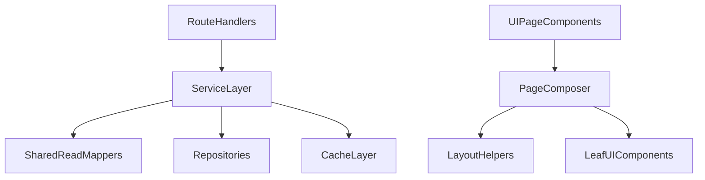

# Modularity Compliance Remediation Plan

## Scope and audit outcome

Reviewed frontend and backend with a high-confidence bar (architecture risk, correctness risk, maintainability/doc gaps). Not all modules are non-compliant; several helper and core modules already follow desired patterns.

### Highest-risk non-compliant modules

- Frontend:
  - [frontend/components/features/section-page.tsx](frontend/components/features/section-page.tsx)
  - [frontend/components/features/homepage.tsx](frontend/components/features/homepage.tsx)
  - [frontend/lib/graphql/server-fetch.ts](frontend/lib/graphql/server-fetch.ts)
  - [frontend/components/ui/story-card.tsx](frontend/components/ui/story-card.tsx)
  - [frontend/components/ui/masthead.tsx](frontend/components/ui/masthead.tsx)
  - [frontend/components/ui/article-lead-media.tsx](frontend/components/ui/article-lead-media.tsx)
  - [frontend/lib/api/auth.ts](frontend/lib/api/auth.ts)
  - [frontend/lib/helpers/text-helpers.ts](frontend/lib/helpers/text-helpers.ts)
  - [frontend/lib/api/rest-client.ts](frontend/lib/api/rest-client.ts)
  - [frontend/lib/presentation-registry.ts](frontend/lib/presentation-registry.ts)
- Backend:
  - [backend/shared/shared/core/cache.py](backend/shared/shared/core/cache.py)
  - [backend/news_storage_app/news_storage_app/services/article_service.py](backend/news_storage_app/news_storage_app/services/article_service.py)
  - [backend/news_storage_app/news_storage_app/services/search_service.py](backend/news_storage_app/news_storage_app/services/search_service.py)
  - [backend/news_storage_app/news_storage_app/services/media_service.py](backend/news_storage_app/news_storage_app/services/media_service.py)
  - [backend/shared/shared/core/health.py](backend/shared/shared/core/health.py)
  - [backend/shared/shared/read/site_reads.py](backend/shared/shared/read/site_reads.py)
  - [backend/admin_app/seed_dev.py](backend/admin_app/seed_dev.py)
  - [backend/shared/shared/repositories/article_repository.py](backend/shared/shared/repositories/article_repository.py)
  - [backend/shared/shared/read/article_reads.py](backend/shared/shared/read/article_reads.py)

## Design direction

## Phase 1: Correctness and fail-loud fixes (first)

1. Backend cache invalidation bug:
   - Update market invalidation key pattern in [backend/shared/shared/core/cache.py](backend/shared/shared/core/cache.py) to match `graphql:homepageFeed:{page}:{market}:{town}` format.
   - Add a focused integration/unit test proving market-scoped invalidation removes expected keys.
2. Backend article mapping drift:
   - Stop using duplicated private mappers in [backend/news_storage_app/news_storage_app/services/article_service.py](backend/news_storage_app/news_storage_app/services/article_service.py).
   - Reuse shared mappers from [backend/shared/shared/read/article_reads.py](backend/shared/shared/read/article_reads.py), ensuring `video_url` is preserved.
   - Update [backend/news_storage_app/news_storage_app/services/search_service.py](backend/news_storage_app/news_storage_app/services/search_service.py) to avoid importing private `_to_article_out`.
3. Frontend SSR GraphQL error handling:
   - Replace silent `catch { return undefined }` in [frontend/lib/graphql/server-fetch.ts](frontend/lib/graphql/server-fetch.ts) with explicit error surfacing (log + throw or typed result), distinguishing true "not found" from fetch failures.
4. Fail loudly on destructive paths:
   - In [backend/news_storage_app/news_storage_app/services/media_service.py](backend/news_storage_app/news_storage_app/services/media_service.py), raise `NotFoundError` when delete target does not exist.
   - In [backend/shared/shared/core/health.py](backend/shared/shared/core/health.py), add structured `logger.error(..., exc_info=True)` on dependency check exceptions.

## Phase 2: Frontend modularity refactor

1. Extract shared feed layout logic:
   - Create helper module (for example `frontend/lib/helpers/feed-layout.ts`) to centralize slot grouping, editorial band construction, and hero article splitting currently duplicated between:
     - [frontend/components/features/homepage.tsx](frontend/components/features/homepage.tsx)
     - [frontend/components/features/section-page.tsx](frontend/components/features/section-page.tsx)
2. Reduce component responsibilities and parameter complexity:
   - Introduce typed layout config objects for `SectionPage`/`WorldPage` so page variants pass one config object rather than many boolean/number props.
   - Split oversized components into leaf components/hooks:
     - [frontend/components/ui/story-card.tsx](frontend/components/ui/story-card.tsx) into variant-specific components.
     - [frontend/components/ui/masthead.tsx](frontend/components/ui/masthead.tsx) into separate behavior hooks (`scroll lock`, `ad ribbon`, `controls`).
     - [frontend/components/ui/article-lead-media.tsx](frontend/components/ui/article-lead-media.tsx) into playback hooks and presentational wrapper.
3. Remove magic values and inline business rules:
   - Replace hero slot numeric indices and ad-placement transition strings with named constants/rule maps in helpers.

## Phase 3: Backend modularity refactor

1. Split monolithic seed module:
   - Decompose [backend/admin_app/seed_dev.py](backend/admin_app/seed_dev.py) into focused modules (`seed data`, `article upsert`, `layout upsert`, `orchestration`) while retaining a thin CLI entrypoint.
2. Split long read orchestration:
   - Refactor [backend/shared/shared/read/site_reads.py](backend/shared/shared/read/site_reads.py) `get_home_feed` into small pure helper steps (slot resolution, slot serialization, assembly).
3. Eliminate duplicated constants and magic numbers:
   - Consolidate collection name constants to shared source.
   - Replace hardcoded query limits in [backend/shared/shared/read/article_reads.py](backend/shared/shared/read/article_reads.py) with named constants.

## Phase 4: Documentation and standards compliance pass

1. Add missing public API docs:
   - Frontend public exports in:
     - [frontend/lib/api/auth.ts](frontend/lib/api/auth.ts)
     - [frontend/lib/helpers/text-helpers.ts](frontend/lib/helpers/text-helpers.ts)
     - [frontend/lib/api/rest-client.ts](frontend/lib/api/rest-client.ts)
     - [frontend/lib/presentation-registry.ts](frontend/lib/presentation-registry.ts)
   - Backend public methods/classes in:
     - [backend/news_storage_app/news_storage_app/services/article_service.py](backend/news_storage_app/news_storage_app/services/article_service.py)
     - [backend/layout_admin_app/layout_admin_app/services/slot_service.py](backend/layout_admin_app/layout_admin_app/services/slot_service.py)
     - [backend/shared/shared/repositories/article_repository.py](backend/shared/shared/repositories/article_repository.py)
2. Ensure doc formats match standards:
   - TypeScript: JSDoc with `@param`, `@returns`, `@throws`.
   - Python: Google-style docstrings with `Args`, `Returns`, `Raises`.

## Validation gates

- Backend:
  - Add/adjust tests for cache invalidation key matching and article mapper field parity.
  - Run backend test targets for affected services and shared modules.
- Frontend:
  - Add unit tests for extracted feed-layout/ad-placement helpers.
  - Run lint/typecheck/tests for touched frontend modules.
- Compliance spot-check:
  - Re-run focused audit on touched files for function size, parameter count, SRP, and doc coverage.

## Delivery sequencing (PR slicing)

1. PR A: correctness fixes (cache pattern, fail-loud behavior, mapper parity).
2. PR B: frontend layout helper extraction + `SectionPage`/`Homepage` dedupe.
3. PR C: component decomposition (`StoryCard`, `Masthead`, `ArticleLeadMedia`).
4. PR D: backend seed/read modularization.
5. PR E: docstrings/JSDoc and constants cleanup.
