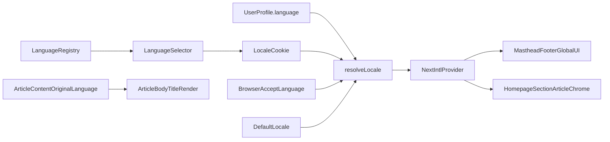

# Multilingual Platform Plan (Long-Term)

## Scope and Non-Goals

- Keep current URL strategy (no locale-prefixed routes for this phase).
- Localize all non-editorial platform text (navigation, masthead, footer, labels, buttons, loading/error, metadata chrome).
- Keep news/editorial content in its original language (`article.title`, `body`, `breaking text` from CMS/API).
- Start with English + Spanish; architecture must support adding languages by configuration and resource files.

## Architecture Decisions

### 1) Standardize on `next-intl` (App Router)

- Use `next-intl` instead of a custom translation context for message lookup, ICU formatting, fallback locale support, and namespace organization.
- Add framework integration points:
  - [frontend/i18n/request.ts](frontend/i18n/request.ts)
  - [frontend/middleware.ts](frontend/middleware.ts) (only for locale detection/persistence without URL prefixing)
  - [frontend/app/layout.tsx](frontend/app/layout.tsx) for `lang` and provider wiring
  - [frontend/app/providers.tsx](frontend/app/providers.tsx) to host `NextIntlClientProvider`

### 2) Domain-based translation resources + key strategy

- Organize translation files by locale and domain namespaces:
  - [frontend/messages/en/common.json](frontend/messages/en/common.json)
  - [frontend/messages/en/navigation.json](frontend/messages/en/navigation.json)
  - [frontend/messages/en/home.json](frontend/messages/en/home.json)
  - [frontend/messages/en/auth.json](frontend/messages/en/auth.json)
  - [frontend/messages/es/common.json](frontend/messages/es/common.json)
  - [frontend/messages/es/navigation.json](frontend/messages/es/navigation.json)
  - [frontend/messages/es/home.json](frontend/messages/es/home.json)
  - [frontend/messages/es/auth.json](frontend/messages/es/auth.json)
- Enforce key-based usage (`navigation.topStories`) and avoid source-string keys.
- Add a conventions doc for key naming and namespace ownership:
  - [frontend/docs/i18n-key-conventions.md](frontend/docs/i18n-key-conventions.md)

### 3) Language preference resolution (enterprise order)

- Resolve active language in this priority:
  1. Authenticated user profile preference (when available)
  2. Locale cookie
  3. Browser `Accept-Language`
  4. Default locale
- Implement shared locale resolution utilities:
  - [frontend/lib/i18n/locale-resolution.ts](frontend/lib/i18n/locale-resolution.ts)
  - [frontend/lib/locale-server.ts](frontend/lib/locale-server.ts)
- Persist user-triggered changes in cookie and (for faster client boot) local storage cache.
- Add integration seam for profile persistence in current auth model:
  - [frontend/lib/api/auth.ts](frontend/lib/api/auth.ts)

### 4) Dynamic language registry

- Replace static hardcoded supported languages with a registry source:
  - [frontend/lib/i18n/language-registry.ts](frontend/lib/i18n/language-registry.ts)
- Initial registry can be local config, but expose a loader boundary to support future DB/CMS-driven language catalogs.
- Registry entry shape:

- - `code`, `displayName`, `nativeName`, `isEnabled`, `textDirection`

### 5) Top navigation language selector

- Add selector in masthead and populate options from the language registry:
  - [frontend/components/ui/masthead.tsx](frontend/components/ui/masthead.tsx)
- Localize label, ARIA text, and option text.
- Keep market selector independent from language selector.

### 6) Migrate shared platform UI to translation keys

- Migrate highest-impact shared surfaces first:
  - [frontend/lib/helpers/section-labels.ts](frontend/lib/helpers/section-labels.ts)
  - [frontend/components/ui/masthead.tsx](frontend/components/ui/masthead.tsx)
  - [frontend/components/ui/footer.tsx](frontend/components/ui/footer.tsx)
  - [frontend/app/layout.tsx](frontend/app/layout.tsx)
- Then migrate core pages/components:
  - [frontend/components/features/homepage.tsx](frontend/components/features/homepage.tsx)
  - [frontend/components/features/section-page.tsx](frontend/components/features/section-page.tsx)
  - [frontend/app/(site)/article/[slug]/ui.tsx](<frontend/app/(site)/article/[slug]/ui.tsx>)
  - [frontend/app/(site)/article/[slug]/page.tsx](<frontend/app/(site)/article/[slug]/page.tsx>)
- Update locale-aware formatting via `next-intl` formatters for date/number/time.

### 7) Preserve editorial/news language integrity

- Explicitly exclude article/breaking content fields from UI translation.
- Keep GraphQL schema/contracts/generated artifacts unchanged:
  - [frontend/lib/graphql/generated/graphql.ts](frontend/lib/graphql/generated/graphql.ts)
  - [frontend/lib/graphql/operations/homepage.graphql](frontend/lib/graphql/operations/homepage.graphql)
  - [frontend/lib/graphql/schema.graphql](frontend/lib/graphql/schema.graphql)
- Add guardrails note in docs so future contributors do not translate content payload fields.

### 8) Fallbacks, quality gates, and rollout safety

- Configure default locale fallback and missing-key behavior.
- Add CI checks for message-file completeness (at minimum: required namespace keys present per enabled locale).
- Validate EN/ES switching on homepage, nav, section pages, and article chrome.
- Run lint/type checks for all touched areas.

## Data Flow

## Deliverable Outcome

- An enterprise-grade multilingual foundation based on `next-intl`, not custom ad hoc state.
- Language expansion becomes a configuration + message resource operation.
- Platform UI text is multilingual; editorial/news content remains in source language by design.
