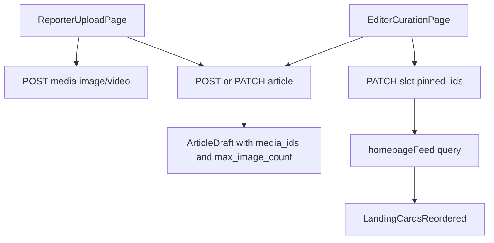

# Phase-1 Reporter + Editor Workflow Plan

## Scope Confirmed

- Build both workflows now:
  - Reporter upload page (title, text, multiple images with drag-drop order, optional video).
  - Editor landing curation page (list uploaded news, reorder selected story images, set per-article image max, choose homepage location with down-shift behavior).
- Account onboarding in phase-1: users are created by admin (no self-registration UI).

## Current Architecture To Reuse

- Frontend auth shell and token handling in [`frontend/lib/api/auth.ts`](frontend/lib/api/auth.ts) and [`frontend/app/(admin)/admin/layout.tsx`](frontend/app/(admin)/admin/layout.tsx).
- News write APIs in [`backend/news_storage_app/news_storage_app/routers/articles.py`](backend/news_storage_app/news_storage_app/routers/articles.py) and [`backend/news_storage_app/news_storage_app/routers/media.py`](backend/news_storage_app/news_storage_app/routers/media.py).
- Homepage slot placement model (`order_index`, `pinned_ids`) in [`backend/layout_admin_app/layout_admin_app/routers/slots.py`](backend/layout_admin_app/layout_admin_app/routers/slots.py) and feed resolution in [`backend/shared/shared/read/site_reads.py`](backend/shared/shared/read/site_reads.py).

## Backend Changes (phase-1 minimum)

- Extend article write schemas so uploaded/reordered media can be persisted:
  - Update [`backend/shared/shared/schemas/article_schemas.py`](backend/shared/shared/schemas/article_schemas.py) to support writable `media_ids`, `video_url`, and a new per-article `max_image_count` field.
  - Wire these fields through [`backend/news_storage_app/news_storage_app/services/article_service.py`](backend/news_storage_app/news_storage_app/services/article_service.py).
- Keep placement behavior slot-driven:
  - Reuse `pinned_ids` order as the canonical rank for landing cards.
  - Implement helper logic in editor API layer (or frontend client logic with safe patch calls) to insert selected article ID at target index and shift remaining IDs down.
- Enforce image count at save-time:
  - Validate `len(media_ids) <= max_image_count` when editor updates article media.

## Frontend Changes

- Add role-aware admin routing shell:
  - Keep existing `/admin/login`, but route users to role-specific views after login (`reporter` -> upload, `editor/admin` -> curation).
  - Implement in [`frontend/app/(admin)/admin/login/page.tsx`](frontend/app/(admin)/admin/login/page.tsx) and [`frontend/app/(admin)/admin/layout.tsx`](frontend/app/(admin)/admin/layout.tsx).
- Reporter upload UI:
  - New page in admin route group for article creation/edit draft.
  - Inputs: title, body, images (multi-select), drag-drop image reorder, video upload.
  - Use multipart upload calls to media endpoints (new helper alongside [`frontend/lib/api/rest-client.ts`](frontend/lib/api/rest-client.ts)).
- Editor landing curation UI:
  - New page listing uploaded stories (start from existing list in [`frontend/app/(admin)/admin/page.tsx`](frontend/app/(admin)/admin/page.tsx)).
  - Controls per story: reorder attached images, set max image count, choose target landing position.
  - On placement action, compute new `pinned_ids` array with insertion semantics and patch slot.

## Data Flow (Phase-1)

## Validation and QA

- Reporter can create draft with ordered images + video and save successfully.
- Editor can set `max_image_count`; save is rejected if media count exceeds limit.
- Editor can pick a landing index; selected story moves to that position and stories below shift down.
- Role gates verified:
  - Reporter cannot access publish-only/editor-only controls.
  - Editor/admin can access curation page.
- Smoke check homepage reflects changed pinned order immediately after cache invalidation.

## Out of Scope (kept for later phase)

- Public self-registration flow.
- Advanced media processing (transcoding, crops, derivatives).
- Town/edition placement expansion beyond current landing scope.
