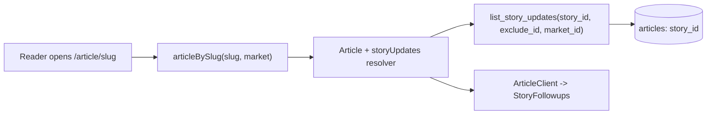

# Story follow-up coverage

## Goal

Group an event's articles via a single `story_id`. When a reader opens the newest article, render its full body, then a stacked list of the other articles in the same story (newest-first): one image (`thumbnail_url`) + short text excerpt + "Read more" link to the full article. No dedicated story page. Grouping is set manually by editors.

## Data flow

## Backend (Python)

Thread `story_id` through every layer (model is `extra="forbid"`).

- `backend/shared/shared/models/article.py`: add `story_id: str | None = None`.
- `backend/shared/shared/schemas/article_schemas.py`: add `story_id: str | None = None` to `ArticleCreate`, `ArticleUpdate`, and `ArticleDetailOut`. Add a `STORY_UPDATES_LIMIT = 6` constant.
- `backend/shared/shared/read/article_reads.py`:
  - In `article_detail_out`, pass `story_id=doc.get("story_id")`.
  - New `list_story_updates(db, *, story_id, exclude_id, market_id=None, loader=None, limit=STORY_UPDATES_LIMIT) -> list[ArticleDetailOut]`: query `{status: "published", story_id, _id: {$ne: exclude_id}}` (+ `market_ids` when provided), `.sort("published_at", -1).limit(limit)`, map via `article_detail_out` (mirrors `list_category_articles`).
- `backend/news_storage_app/news_storage_app/services/article_service.py`: persist `story_id` in `_new_article_doc` (`body.story_id`); `_build_update_doc` already passes through non-null update fields, so PATCH works automatically.

## GraphQL subgraph (Strawberry)

- `backend/subgraphs/content_subgraph/content_subgraph/types.py`:
  - Add `story_id: str | None = None` and a non-exposed-by-default `market_ids: list[str] | None = None` to `Article`; set both in `article_from_detail` (needed so the nested resolver can market-scope without a field arg).
  - Add `@strawberry.field async def story_updates(self, info) -> list["Article"]`: returns `[]` if `self.story_id` is falsy; else calls `article_reads.list_story_updates(db, story_id=self.story_id, exclude_id=str(self.id), market_id=self.market_ids[0] if self.market_ids else None, loader=info.context.authors)` and maps each via `article_from_detail`. Pattern matches the existing `media` resolver.
- Recompose/restart the federated router so the new fields appear in the supergraph (check `backend/graphql_router` for a committed supergraph SDL to regenerate).

## Frontend (Next.js)

- `frontend/lib/graphql/operations.ts` + `frontend/lib/graphql/operations/article.graphql`: add `storyId` and a `storyUpdates { id slug title body thumbnailUrl publishedAt createdAt }` selection to `ArticleBySlug`.
- `frontend/lib/graphql/schema.graphql`: add `storyId: ID` and `storyUpdates: [Article!]` to `type Article`; run `npm run codegen`.
- `frontend/interfaces/article.ts`: add `storyId: string | null` and `storyUpdates: IArticle[]` to `IArticleDetail`.
- `frontend/lib/graphql/mappers.ts`: in `mapArticleDetail`, set `storyId` and `storyUpdates: (a.storyUpdates ?? []).map(mapArticle)` — `mapArticle` already derives `summary` from `body` via `htmlToPlainText`, giving the excerpt for free.
- New `frontend/components/features/story-followups.tsx`: `StoryFollowups({ updates }: { updates: IArticle[] })`. Newest-first cards, each: `next/image` thumbnail (skip if null), relative timestamp (`useFormatter`), `summary` truncated, and a `Link` to `/article/[slug]` labeled "Read more". Localized via `next-intl` (`common`). Returns null when empty.
- `frontend/app/[locale]/(site)/article/[slug]/ui.tsx`: render `<StoryFollowups updates={article.storyUpdates} />` after `<ArticleBodyLayout />` in `ArticleClient`. (Also mirror into the untracked non-localized `frontend/app/(site)/article/[slug]/ui.tsx` if that route is kept.)
- Add i18n keys (e.g. `earlierInThisStory`, `readMore`) to `frontend/messages/en/common.json` and `es/common.json`.

## Editor admin (manual grouping)

- `frontend/hooks/use-editor-curation.ts`: add `story_id` to the `IArticleDetail` interface, seed it in `loadArticleDetail`, hold `storyId` state, and include `story_id: storyId || null` in the `saveArticleChanges` PATCH body.
- `frontend/components/features/editor-article-detail-panel.tsx`: add a text input for the story id/slug (wired through `wrapWithDirty`), so editors assign follow-ups to the same story.

## Seed (full reseed)

- `backend/admin_app/seed_dev.py`: give a couple of US stories a shared `story_id` (e.g. the Baltimore-bridge spec plus 2-3 of the plain follow-up titles) to demo the feature. Add `story_id` to `SeedStorySpec`, read it in `_market_article_fields`/`_new_market_article_doc`, then reseed with `docker compose exec admin_app python seed_dev.py`.

## Notes / decisions

- Excerpt is reused from the existing client-side `summary` derivation; no new stored field.
- "Read more" navigates to the full article (simpler, better SEO/analytics) rather than inline expand.
- Follow-ups query is cheap: `thumbnail_url` is already on the doc, so no media-collection join is needed.
- Market scoping uses the parent article's first market id; safe for the single-market seed data.
