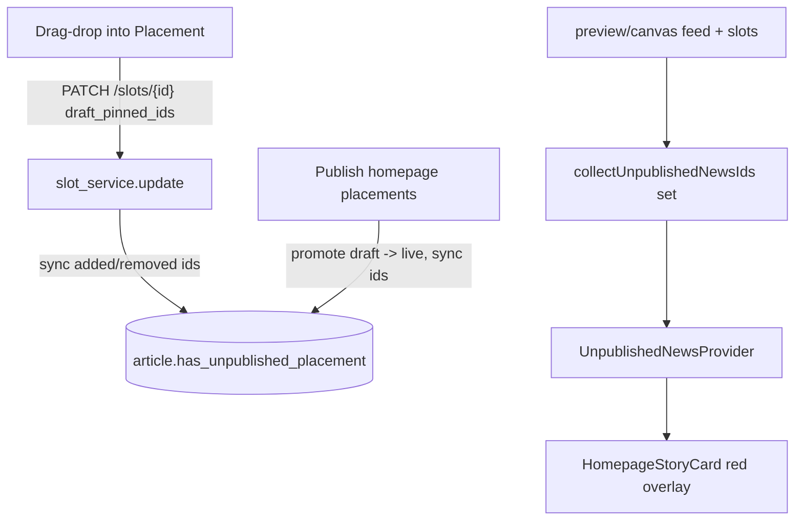

## Goal

When a news is dragged into Placement, show a red indicator covering that card in **both** the Placement canvas and the Preview page until it is published, and persist a backend flag other code can query.

Confirmed decisions:

- Indicator pages: **Placement + Preview**.
- "Not published" means **either** the placement is staged (slot `draft_pinned_ids` differs from `pinned_ids`) **or** the article status is not `published` (still `draft`/`review`).
- Flag: a **persisted backend boolean** on the article.

## Why this injection point

Every homepage card on both pages funnels through `HomepageStoryCard` (`frontend/components/ui/homepage-story-card.tsx`) -> `PlacementOverlay` -> `StoryCard`. The Placement canvas wraps the feed in `EditorPlacementProvider`; the Preview pane renders the same `HomepageContent` with no editor context. So a small, separate context (independent of the editor context) is the cleanest way to drive the overlay in both places.

## Frontend - red indicator (Placement + Preview)

- New `frontend/lib/helpers/unpublished-news.ts`: `collectUnpublishedNewsIds(feed, slots): Set<string>` = union of (a) feed article ids whose `status` is in `{draft, review}` (reuse the set in [frontend/lib/helpers/preview-publish-articles.ts](frontend/lib/helpers/preview-publish-articles.ts)) and (b) article ids that are staged in any slot (in `draft_pinned_ids` but not in `pinned_ids`), reusing `slotHasUnpublishedPlacementChanges` from [frontend/lib/helpers/slot-editor-pinned-ids.ts](frontend/lib/helpers/slot-editor-pinned-ids.ts).
- New `frontend/context/unpublished-news-context.tsx`: provider exposing `{ ids: Set<string>, label: string }` and a `useUnpublishedNews()` hook (returns null outside admin, so the public site is unaffected).
- Edit [frontend/components/ui/homepage-story-card.tsx](frontend/components/ui/homepage-story-card.tsx): wrap the existing `PlacementOverlay`/`StoryCard` in a new `UnpublishedNewsBadge` that reads the context; when `props.article.id` is in `ids`, render the children inside a `relative` container with an absolute, `pointer-events-none` red overlay (e.g. `bg-red-500/30 ring-2 ring-red-500`) and a small red `label` badge. When the id is absent (or no context), render children untouched. Keeping `pointer-events-none` preserves drag/drop and the existing move/remove toolbar.
- Edit [frontend/components/features/homepage-placement-canvas.tsx](frontend/components/features/homepage-placement-canvas.tsx): compute the set from `feed` + `homepageSlots` (already props) and wrap `HomepageContent` with `UnpublishedNewsProvider`, label from `t('editor.placement.unpublishedIndicator')`.
- Edit [frontend/components/features/homepage-preview-pane.tsx](frontend/components/features/homepage-preview-pane.tsx): add a `homepageSlots` prop, compute the set, and wrap `HomepageContent` with the same provider/label.
- Edit [frontend/app/(admin)/admin/preview/page.tsx](<frontend/app/(admin)/admin/preview/page.tsx>): pass the already-available `homepageSlots` into `HomepagePreviewPane`. (Placement page needs no change - the canvas already receives `feed` and `homepageSlots`.)
- i18n: add `editor.placement.unpublishedIndicator` (e.g. "Not published") to [frontend/messages/en/admin.json](frontend/messages/en/admin.json) and [frontend/messages/es/admin.json](frontend/messages/es/admin.json).

## Backend - persisted flag

- Add `has_unpublished_placement: bool = False` to `Article` in [backend/shared/shared/models/article.py](backend/shared/shared/models/article.py) (model has `extra: forbid`, so the field must be declared) and expose it on `ArticleOut` in [backend/shared/shared/schemas/article_schemas.py](backend/shared/shared/schemas/article_schemas.py) so other code reading articles can query it.
- New helper `backend/shared/shared/core/placement_flags.py`: `sync_unpublished_placement_flags(db, article_ids)` - for each id, authoritatively recompute whether it is staged in any slot (`SLOTS_COLLECTION` doc where `draft_pinned_ids` differs from `pinned_ids` and the id is in `draft_pinned_ids` but not `pinned_ids`) and `update_many` `articles.has_unpublished_placement` to the computed boolean. Authoritative recompute (vs incremental) keeps add/remove/publish all correct.
- Wire into [backend/layout_admin_app/layout_admin_app/services/slot_service.py](backend/layout_admin_app/layout_admin_app/services/slot_service.py):
  - In `update`, alongside the existing `_record_slot_placements`, gather affected ids (added via `compute_added_ids(old, new)` and removed via `compute_added_ids(new, old)` over `draft_pinned_ids`/`pinned_ids`) and call `sync_unpublished_placement_flags`.
  - In `publish_draft_pins_for_layout`, after promoting draft->live, collect the promoted ids and call `sync_unpublished_placement_flags` (they will resolve to `False` since draft now matches live).

## Semantics note for "another code"

The persisted `has_unpublished_placement` captures the **staged-placement** dimension (the new signal introduced by a drop). The article **status** field already captures the draft/review dimension. To match the red indicator exactly, downstream code identifies "not published" news as `has_unpublished_placement == True OR status != 'published'`. (If a single combined boolean is preferred instead, that is a small follow-up - flag it before building.)

## Validation

- Drop a published story into a slot -> red overlay appears on that card in Placement and Preview; `articles.has_unpublished_placement` becomes `True`.
- Drop a draft story -> overlay shows via both status and staged-placement; remains until published.
- Publish homepage placements -> overlays clear and flag becomes `False`.
- Public homepage renders with no overlay (no context) and no behavior change.

## Constraints

- "Do not modify anything else": no changes to drag/drop mechanics, publish endpoints' external behavior, or unrelated card styling; overlay is `pointer-events-none` and additive.
- Follow `.cursorrules`: docstrings/JSDoc on new public functions/components, custom exceptions where applicable, functions <=30 lines, named constants for status sets and styling strings.
