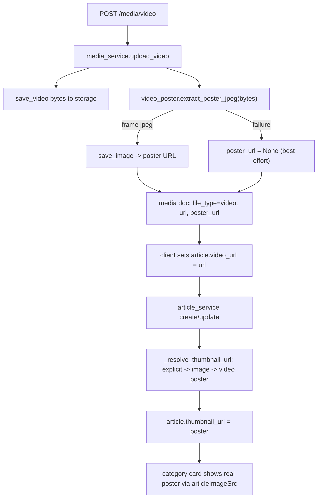

# Server-side video poster extraction

## Goal

When a video is uploaded, extract a real frame, save it as a JPEG poster, attach it to the video's `media` document, and make article thumbnail resolution fall back to that poster. Category/section cards then render a real image via the existing `articleImageSrc` (`thumbnailUrl`) path - no client-side video hack needed for new content.

## Flow

## Changes

### 1. Dependency (bundled ffmpeg)

Add to [backend/news_storage_app/requirements.txt](backend/news_storage_app/requirements.txt):

- `imageio-ffmpeg>=0.5` (ships a static ffmpeg binary via `imageio_ffmpeg.get_ffmpeg_exe()`, no system install).
- `Pillow>=10.2` is already listed and will be used to downscale/encode the JPEG.

### 2. New extraction module

Create `backend/news_storage_app/news_storage_app/services/video_poster.py`:

- `extract_poster_jpeg(content: bytes, *, at_seconds: float = 1.0, max_width: int = 1280) -> bytes | None`
- Writes `content` to a `tempfile.NamedTemporaryFile`, resolves the ffmpeg binary with `imageio_ffmpeg.get_ffmpeg_exe()`, and runs (via `subprocess.run` with a timeout) roughly:
  `ffmpeg -ss {at_seconds} -i {tmp} -frames:v 1 -vf scale='min(max_width,iw)':-2 -f image2 -y {out.jpg}`
  (seek before `-i` for speed; falls back to `-ss 0` if the clip is shorter than `at_seconds`).
- Best-effort: catch `subprocess.SubprocessError`/`OSError`/timeout, `logger.error(..., exc_info=True)`, return `None` so a failed extraction never blocks the upload (fail loud in logs, soft in product). Keep the function <30 lines by splitting the ffmpeg-arg build into a small private helper.

### 3. Wire poster into video upload

Edit `upload_video` in [backend/news_storage_app/news_storage_app/services/media_service.py](backend/news_storage_app/news_storage_app/services/media_service.py) (currently lines 92-114):

- After `url = save_video(...)`, call `poster_bytes = extract_poster_jpeg(content)`.
- If present, `poster_url = save_image(content=poster_bytes, extension="jpg")`, else `None`.
- Add `"poster_url": poster_url` to the inserted `doc`.
- Include `poster_url` in `_to_out` (line 30) so `MediaOut` returns it.
- Extraction is run synchronously (single-frame grab is sub-second regardless of file size with pre-input `-ss`), guaranteeing the poster exists before the client creates the article. Bounded by a subprocess timeout.

### 4. Model + schema

- [backend/shared/shared/models/media_asset.py](backend/shared/shared/models/media_asset.py): add `poster_url: str | None = None` (model has `extra: "forbid"`, so the field must be declared).
- [backend/shared/shared/schemas/media_schemas.py](backend/shared/shared/schemas/media_schemas.py): add `poster_url: str | None = None` to `MediaOut`.

### 5. Article thumbnail resolution falls back to video poster

In [backend/news_storage_app/news_storage_app/services/article_service.py](backend/news_storage_app/news_storage_app/services/article_service.py):

- Add `_poster_from_video_url(db, video_url)` that queries `{"file_type": "video", "url": video_url}` and returns its `poster_url`.
- Extend `_resolve_thumbnail_url` (lines 147-166) to accept `video_url` and resolve: `explicit -> image-from-media_ids -> video poster -> None`.
- Create path: pass `body.video_url` at the `_prepare_new_article` call (line 277).
- Update path: in `_normalize_update_media` (lines 500-505), re-resolve when `"media_ids" in update_doc or "video_url" in update_doc` (and no explicit `thumbnail_url`), passing the effective `video_url` (`update_doc.get("video_url", existing.get("video_url"))`).

### 6. Frontend

No new work required. The already-shipped client-side `preview-frame` fallback in [frontend/components/ui/story-card.tsx](frontend/components/ui/story-card.tsx) stays as a graceful fallback for legacy videos uploaded before this feature or when extraction failed (poster missing -> `thumbnailUrl` null -> existing `articleCardPreviewVideoSrc` shows a client frame). New uploads will simply have a real `thumbnailUrl` and render it directly.

### 7. Backfill (optional, recommended)

Add `backend/scripts/backfill_video_posters.py`: iterate `media` docs with `file_type="video"` and no `poster_url`, re-download/read the file, run `extract_poster_jpeg`, `save_image`, and update the doc. Run once so existing videos get posters.

### 8. Tests (`backend/tests/`, pytest-asyncio, flat dir)

- `test_media.py`: `upload_video` sets `poster_url` (monkeypatch `extract_poster_jpeg` to return fixed bytes so no real ffmpeg needed in CI); extraction failure -> `poster_url=None` and upload still succeeds.
- `test_article_service.py`: `_resolve_thumbnail_url` returns the video poster when there is no explicit thumbnail and no image media.

## Notes / decisions

- Poster is stored as a normal image asset via existing `save_image`, so it works for both `local` and `s3` backends with no new storage code.
- `width/height/duration` on the media doc remain out of scope (still `None`); can be populated later via ffprobe if desired.
- Extraction is best-effort: a broken/transcoding-heavy video never blocks the upload.
