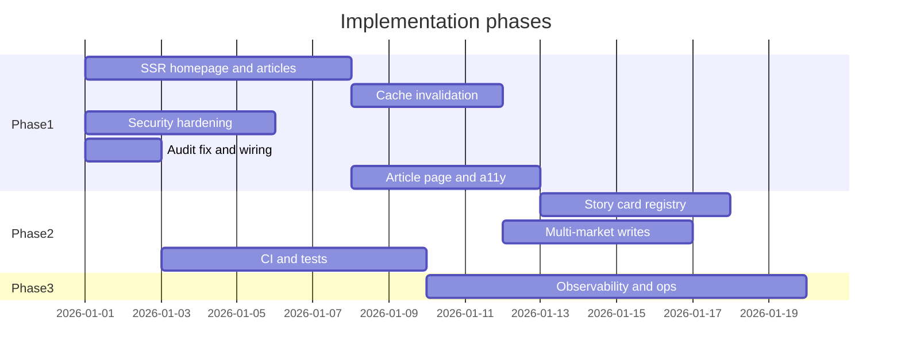

# Architecture Implementation Plan

Prioritized roadmap derived from the full-stack architecture evaluation of NewsCore. Use this document to harden the platform from MVP scaffold toward production readiness while preserving the slot-driven homepage, federated GraphQL read stack, and multi-market direction.

**Related:** [backend-apps.md](./backend-apps.md), [MULTI_MARKET_PLAN.md](./MULTI_MARKET_PLAN.md), [GRAPHQL.md](./GRAPHQL.md)

---

## Executive summary

| Area | Current maturity | Target |
|------|------------------|--------|
| Frontend | Early MVP — good modular direction | SSR, a11y, unified cards, design tokens |
| Backend | Dev scaffold — strong boundaries | Cache consistency, security, tests, ops |
| FE/BE alignment | Good — `presentationType` contract | Complete multi-market write path |
| Production readiness | Low | CI/CD, monitoring, hardened defaults |

**Top risks to address first:**

1. Client-only content rendering (SEO, LCP, empty first paint)
2. Stale homepage Redis cache after editorial writes
3. Public GraphQL with dev-oriented security defaults

**Preserve these patterns** (do not refactor away):

- Slot + `presentationType` driven homepage modules
- REST for editorial writes, federated GraphQL for public reads
- `backend/shared/read/` as the single source of truth for public data shape
- Frontend `components/ui/` vs `components/features/` split
- Market as a first-class dimension in the data layer

---

## Phase 1 — Production blockers (High)

Estimated focus: correctness, security, and user-visible quality. Complete before accepting production traffic.

### 1.1 Server-side rendering for homepage and articles

**Problem:** Apollo Client mounts only in the browser (`frontend/app/providers.tsx`). All hooks use `ssr: false`. Users see a "Loading…" flash; articles and homepage content are absent from initial HTML.

**Impact:** Poor SEO, slow LCP, weak crawlability for a news product.

**Tasks:**

- [ ] Add a server-side GraphQL fetch helper in `frontend/lib/graphql/` (plain `fetch` to `/graphql` or `@apollo/experimental-nextjs-app-support`)
- [ ] Fetch homepage feed in `frontend/app/page.tsx` (Server Component) for `market` from cookie or default
- [ ] Fetch article by slug in `frontend/app/article/[slug]/page.tsx` for initial render
- [ ] Pass server-fetched data as props to client components; keep Apollo for market switch and polling
- [ ] Remove or narrow the global "Loading…" gate in `providers.tsx` — only defer client-only features

**Acceptance criteria:**

- View source on `/` and `/article/[slug]` shows article titles and slot content in HTML
- Lighthouse SEO score improves; LCP no longer blocked on client hydration

**Key files:**

- `frontend/app/providers.tsx`
- `frontend/app/page.tsx`
- `frontend/app/article/[slug]/page.tsx`
- `frontend/hooks/use-feed.ts`, `frontend/hooks/use-article.ts`
- `frontend/lib/graphql/operations.ts`

---

### 1.2 Cache invalidation on editorial writes

**Problem:** Homepage feed is cached in Redis (`site_subgraph`). Invalidation exists only in `backend/admin_app/seed_dev.py`, not in publish or layout mutation paths.

**Impact:** Editors publish content; public site shows stale feed until TTL expires.

**Tasks:**

- [ ] Add `invalidate_homepage_feed(market_code: str)` to `backend/shared/shared/core/cache.py`
- [ ] Call invalidation from `news_storage_app` on article publish/unpublish/update affecting published state
- [ ] Call invalidation from `layout_admin_app` on slot create/update/delete and layout activate
- [ ] Use market-scoped cache keys consistently (align with [MULTI_MARKET_PLAN.md](./MULTI_MARKET_PLAN.md))
- [ ] Add integration test: publish article → `homepageFeed` returns new content without waiting for TTL

**Acceptance criteria:**

- Publishing an article or changing a slot clears the correct Redis key(s)
- No manual seed/cache clear required in normal editorial workflow

**Key files:**

- `backend/shared/shared/core/cache.py`
- `backend/news_storage_app/news_storage_app/services/article_service.py`
- `backend/layout_admin_app/layout_admin_app/services/slot_service.py`
- `backend/layout_admin_app/layout_admin_app/services/layout_service.py`
- `backend/subgraphs/site_subgraph/site_subgraph/types.py`

---

### 1.3 Security hardening

**Problem:** Dev defaults are unsafe for production: open CORS, GraphQL introspection enabled, subgraph errors exposed, no rate limiting, upload size not enforced.

**Impact:** Schema enumeration, abuse, credential stuffing, DoS via uploads.

**Tasks:**

- [ ] Production `router.yaml`: disable introspection; restrict CORS to frontend origin; disable `include_subgraph_errors` or scope to dev profile
- [ ] Restrict CORS on REST apps (`admin_app`, `news_storage_app`, `layout_admin_app`) to known origins
- [ ] Add rate limiting at Nginx (`limit_req`) for `/graphql` and `/api/admin/auth/login`
- [ ] Enforce `MAX_FILE_SIZE_MB` in `media_service.py`; reject oversized uploads before reading full body into memory
- [ ] Document production secret rotation for `JWT_SECRET`; consider RS256 if services deploy independently
- [ ] Remove or gate default seed credentials in production deployments

**Acceptance criteria:**

- Production compose/profile cannot start with `allow_origins=["*"]` and introspection enabled
- Upload over limit returns 413; login endpoint rate-limited

**Key files:**

- `backend/graphql_router/router.yaml`
- `backend/admin_app/main.py`, `backend/news_storage_app/main.py`, `backend/layout_admin_app/main.py`
- `nginx/nginx.conf`
- `backend/news_storage_app/news_storage_app/services/media_service.py`
- `.env.example`

---

### 1.4 Fix audit pagination and wire audit logging

**Problem:** `audit_service.list_events` uses `params.skip` but `PaginationParams` has no `skip` property — runtime error. `write_event()` is defined but never called.

**Impact:** Audit API broken; no trail of editorial actions.

**Tasks:**

- [ ] Add `@property skip` to `PaginationParams` in `backend/shared/shared/core/pagination.py`
- [ ] Call `audit_service.write_event()` from service layer on: user CRUD, article publish/unpublish, slot/layout mutations
- [ ] Add unit test for pagination skip calculation
- [ ] Add test that publish action creates an audit log entry

**Key files:**

- `backend/shared/shared/core/pagination.py`
- `backend/admin_app/admin_app/services/audit_service.py`
- `backend/news_storage_app/news_storage_app/services/article_service.py`
- `backend/layout_admin_app/layout_admin_app/services/slot_service.py`

---

### 1.5 Complete the article page experience

**Problem:** Article route has no masthead, metadata uses raw slug, loading/error styles assume dark background on a light page.

**Impact:** Broken UX, poor SEO titles, inconsistent site chrome.

**Tasks:**

- [ ] Introduce shared site layout (e.g. `app/(site)/layout.tsx`) with `Masthead` on article pages
- [ ] Server-fetch article in `generateMetadata()` for real title and description
- [ ] Fix `frontend/app/article/[slug]/ui.tsx` — use `text-neutral-600` for loading, `prose prose-neutral` for body
- [ ] Add back link or breadcrumb to homepage

**Key files:**

- `frontend/app/article/[slug]/page.tsx`
- `frontend/app/article/[slug]/ui.tsx`
- `frontend/app/layout.tsx` or new route group layout

---

### 1.6 Critical accessibility and mobile navigation

**Problem:** Nav hidden below `md` with no alternative; all images use `alt=""`; no skip link or focus styles; ticker ignores `prefers-reduced-motion`.

**Impact:** WCAG failures; mobile users cannot reach section nav.

**Tasks:**

- [ ] Add mobile nav drawer/sheet (hamburger) mirroring masthead section links
- [ ] Set meaningful `alt` from article titles on story thumbnails
- [ ] Add skip-to-main link in root layout
- [ ] Add global `focus-visible` ring utilities in `globals.css`
- [ ] Guard ticker animation with `@media (prefers-reduced-motion: reduce)`
- [ ] Add `aria-live="polite"` region for breaking news updates
- [ ] Enable `eslint-plugin-jsx-a11y` in frontend lint config

**Key files:**

- `frontend/components/ui/masthead.tsx`
- `frontend/app/globals.css`
- `frontend/components/features/breaking-ticker.tsx`
- `frontend/components/ui/homepage-story-thumb.tsx`, `article-card.tsx`

---

## Phase 2 — Quality and consistency (Medium)

Estimated focus: maintainability, contract completeness, and developer experience.

### 2.1 Unified story card component and presentation registry

**Problem:** Six overlapping card variants (`StoryCard`, `SectionStoryCard`, `VerticalImageStory`, etc.). `ArticleCard` only used by unused layouts.

**Tasks:**

- [ ] Create `frontend/components/ui/story-card.tsx` with variants: `hero-lead`, `compact`, `headline-only`, `rail`, `grid`
- [ ] Add `frontend/lib/presentation-registry.ts` mapping `presentationType` → layout module component
- [ ] Refactor `homepage.tsx`, `homepage-section.tsx`, `homepage-editorial-band.tsx` to use shared card
- [ ] Delete or wire up dead layouts: `homepage-rail.tsx`, `homepage-feed.tsx`

---

### 2.2 Design system tokens

**Problem:** Empty Tailwind `extend`; brand color repeated as arbitrary values.

**Tasks:**

- [ ] Extend `frontend/tailwind.config.ts` with `colors.brand`, font families, spacing scale
- [ ] Replace `text-[color:var(--brand-red)]` with `text-brand` across components
- [ ] Optionally adopt shadcn/ui for Select, Sheet (mobile nav), Button

---

### 2.3 Database index lifecycle

**Problem:** Indexes created only in `seed_dev.py`, not on app startup.

**Tasks:**

- [ ] Extract `_ensure_indexes` from `seed_dev.py` into `backend/shared/shared/core/indexes.py`
- [ ] Call index bootstrap from each app lifespan (idempotent `create_index`)
- [ ] Document production index management in README

---

### 2.4 Complete multi-market write path

**Problem:** Read layer filters by `market_id` / `market_ids`; write schemas and layout creation may omit market fields.

**Tasks:**

- [ ] Add `market_ids` to article create/update schemas and enforce in `article_service`
- [ ] Set `market_id` on layout create in `layout_service`
- [ ] Market-scoped Redis keys for `homepageFeed` and `breakingNews`
- [ ] Verify end-to-end against [MULTI_MARKET_PLAN.md](./MULTI_MARKET_PLAN.md) checklist

**Key files:**

- `backend/shared/shared/schemas/article_schemas.py`
- `backend/layout_admin_app/layout_admin_app/services/layout_service.py`
- `backend/shared/shared/read/site_reads.py`

---

### 2.5 Backend deduplication and write-side N+1 fixes

**Tasks:**

- [ ] Move `register_exception_handlers()` to `backend/shared/shared/core/fastapi_handlers.py`
- [ ] Reuse `AuthorNameLoader` (or `$lookup`) in `article_service.list_all` and `search_service`
- [ ] Add pagination to unbounded list endpoints where missing

---

### 2.6 CI pipeline and test expansion

**Problem:** Two backend test files; no frontend tests; no GitHub Actions.

**Tasks:**

- [ ] Add `.github/workflows/ci.yml`: lint frontend, pytest unit tests on PR
- [ ] Nightly or manual job: `pytest -m integration` against Docker stack
- [ ] REST tests: auth login, role enforcement, article CRUD
- [ ] GraphQL schema snapshot or federation contract test
- [ ] Cache invalidation integration test (from 1.2)

---

### 2.7 GraphQL codegen on frontend

**Problem:** `codegen.ts` exists but operations are inline `gql` strings.

**Tasks:**

- [ ] Move operations to `.graphql` files under `frontend/lib/graphql/`
- [ ] Generate typed hooks/document nodes; update mappers to use generated types
- [ ] Add codegen step to CI

---

### 2.8 Frontend performance

**Tasks:**

- [ ] Configure `images.remotePatterns` in `next.config.js`; remove `unoptimized` where CDN/sources allow
- [ ] Lazy-load below-fold modules with `dynamic()` + `Suspense`
- [ ] Review 15s poll interval vs cache-tag or SSE for breaking news (longer-term)

---

## Phase 3 — Scale and polish (Low)

Estimated focus: long-term extensibility and operational maturity.

### 3.1 Remove legacy delivery app

- [x] Delete or archive `backend/delivery_app/` (already removed from Compose)
- [x] Update root `IMPLEMENTATION_PLAN.md` and README references

---

### 3.2 API versioning

- [x] Prefix REST routes with `/api/v1/` via Nginx or FastAPI `root_path` before external consumers depend on URLs

---

### 3.3 Repository layer (when complexity warrants)

- [x] Introduce thin repositories per domain (`ArticleRepository`, `SlotRepository`) without over-abstracting
- [x] Prefer `shared/models/` types over raw `dict[str, Any]` in services

---

### 3.4 Event-driven integrations

- [x] Redis pub/sub or message queue for cache invalidation, search indexing, notifications
- [x] Decouple write services from cache key knowledge

---

### 3.5 Admin frontend

- [x] Next.js admin app or route group calling REST editorial APIs
- [x] Reuse `components/ui/` patterns; JWT auth flow against Admin API

---

### 3.6 Observability

- [x] Structured JSON logging with request/correlation IDs (`shared/core/logger.py`)
- [ ] OpenTelemetry traces across Nginx → Router → subgraphs
- [x] Health endpoints on all REST apps (match subgraph `/health` pattern)
- [ ] Uptime alerts on `/graphql`, MongoDB, Redis

---

### 3.7 Object storage for media

- [x] Replace filesystem storage with S3-compatible backend per `shared/core/file_storage.py` abstraction
- [x] CDN URLs for images; wire into frontend `next/image` remote patterns

---

## Cross-cutting: FE/BE contract checklist

When adding a new homepage module or editorial feature, verify:

| Step | Backend | Frontend |
|------|---------|----------|
| New card type | Add `presentation_type` on slots; document in schema | Register in `presentation-registry.ts`; add or reuse UI module |
| New market | Seed market; layout per `market_id`; articles with `market_ids` | `MarketContext` + query variables |
| New public query | Subgraph + read layer in `shared/read/` | Hook + mapper + interface |
| New editorial action | REST router → service → audit + cache invalidation | Admin UI or API client (future) |

---

## Suggested execution order

Within Phase 1, **1.3 (security)** and **1.4 (audit)** can run in parallel with **1.1 (SSR)**. **1.2 (cache)** should follow or accompany multi-market key naming decisions.

---

## Success metrics

| Metric | Baseline | Phase 1 target | Phase 2 target |
|--------|----------|----------------|----------------|
| Homepage LCP | Blocked on client JS | Content in first HTML | Optimized images |
| SEO (article title in `<title>`) | Slug only | Real title from server fetch | Open Graph tags |
| Cache staleness after publish | Up to TTL | Immediate invalidation | Event-driven |
| Backend unit test count | ~2 | 20+ | 50+ |
| a11y (axe critical issues) | Multiple | Zero critical on homepage/article | Full site pass |
| REST apps with `/health` | Subgraphs only | All services | + readiness probes |

---

## Document history

| Date | Change |
|------|--------|
| 2026-05-23 | Initial plan from architecture evaluation |
