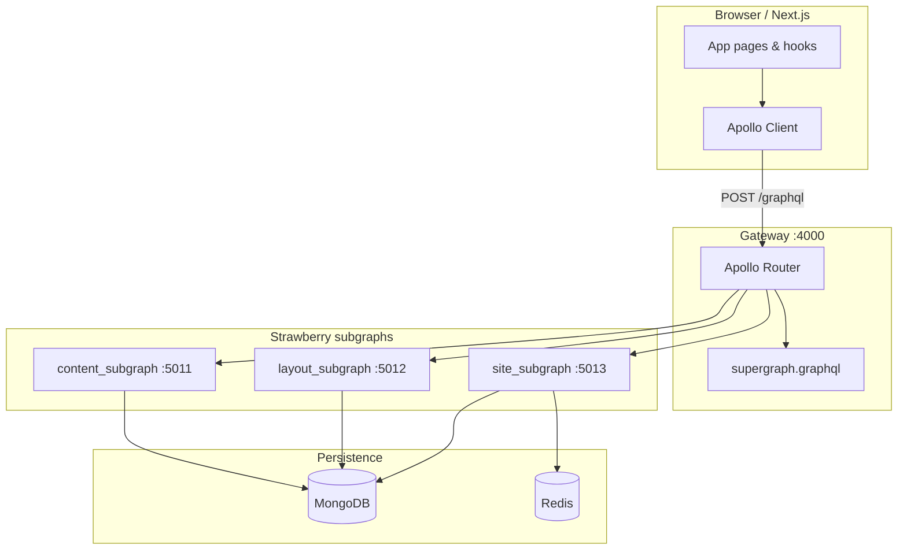

# How GraphQL Works in NewsCore

NewsCore serves **public read traffic** through a federated GraphQL API. Editorial workflows (create articles, manage layouts, admin users) stay on the existing **REST** FastAPI apps. GraphQL replaces the old delivery REST service for homepage, article pages, search, and breaking news.

## High-level picture



| Component | Port | Responsibility |
|-----------|------|----------------|
| **Apollo Router** (`graphql_router`) | 4000 | Single public `/graphql` endpoint; plans and fans out queries to subgraphs |
| **content_subgraph** | 5011 | Owns the `Article` entity; slug, search, category queries |
| **layout_subgraph** | 5012 | Homepage layout and slot metadata |
| **site_subgraph** | 5013 | `homepageFeed`, `breakingNews`; Redis cache for feed |
| **Nginx** | 80 | Proxies `/graphql` → router (same schema as `:4000`) |

REST apps (unchanged for writes):

| App | Port | Role |
|-----|------|------|
| admin_app | 5001 | Users, JWT, reporters |
| news_storage_app | 5002 | Articles, media, tags |
| layout_admin_app | 5003 | Layouts and slots |

---

## Startup: how the gateway comes online

When you run `docker compose up`, Compose waits for each subgraph’s **healthcheck** (`GET /health` on ports 5011–5013) before starting `graphql_router`. The frontend and nginx wait until the router reports healthy on `http://127.0.0.1:8088/health`. If you `docker compose restart` a subgraph, `restart: true` on `depends_on` also restarts the router (and frontend) so federation does not keep calling a stale container IP.

The router container then runs `backend/graphql_router/entrypoint.sh`:

1. **Wait for health** — Polls `http://content-subgraph:5011/health`, layout `:5012`, site `:5013` until each subgraph responds (redundant with Compose healthchecks but ensures the entrypoint can compose even when the router service is started alone).
2. **Compose supergraph** — Runs Apollo Rover:

   ```bash
   rover supergraph compose --config /config/supergraph.yaml --elv2-license accept \
     > /dist/supergraph.graphql
   ```

   Rover fetches each subgraph’s federated schema from its `/graphql` endpoint and merges them into one supergraph SDL file.

3. **Start Apollo Router** — Serves the composed supergraph on `0.0.0.0:4000` at path `/graphql` (see `backend/graphql_router/router.yaml`).

Subgraph URLs are declared in `backend/graphql_router/supergraph.yaml` (Docker DNS names `content-subgraph`, etc.).

To recompose locally without restarting the whole stack (Rover CLI on your machine):

```bash
./scripts/compose-supergraph.sh
```

---

## Federation: three schemas, one API

The stack uses **Apollo Federation 2** (`federation_version: =2.11.0`). Each subgraph is a separate FastAPI app with **Strawberry**’s federation support:

```python
from strawberry.federation import Schema
schema = Schema(query=..., types=[...])
```

The router does not implement resolvers itself. It:

- Parses the client query against the **supergraph** schema.
- Splits work across subgraphs using `@key` and entity references.
- Calls each subgraph’s `/graphql` as needed and stitches the result.

### Entity ownership

| Type | Owner | Federation |
|------|--------|------------|
| `Article` | **content_subgraph** | `@key(fields: "id")` — full fields + `resolve_reference` |
| `Article` (stub) | **site_subgraph** | `extend=True`, `id` external — only references for homepage slots |
| `Slot` | **layout_subgraph** | `@key(fields: "id")` |

**content_subgraph** defines the canonical `Article` type and implements `resolve_reference`: when another subgraph returns `{ id: "..." }`, the router asks content to hydrate full fields (title, slug, body, etc.) from MongoDB.

**site_subgraph** builds `homepageFeed` with lightweight `Article` stubs (`id` only). When the client asks for `articles { title slug authorName }`, the router automatically fetches those fields from content via federation.

### Example: homepage feed query path

Client query (simplified):

```graphql
query HomepageFeed($market: String!, $town: String) {
  homepageFeed(market: $market, town: $town) {
    pageName
    slots {
      id
      positionKey
      displayName
      presentationType
      articles {
        id
        title
        slug
        authorName
      }
    }
  }
}
```

Variables example: `{ "market": "us" }` or `{ "market": "co" }` for Colombia. Default market code is `us` when the argument is omitted on the server.

Execution flow:

1. **Router** receives the query at `POST /graphql`.
2. **site_subgraph** resolves `homepageFeed`:
   - Checks Redis key `graphql:homepageFeed:{market}:{town|_}` (15s TTL).
   - On miss, calls `shared.read.site_reads.get_home_feed(market_code=…)` to assemble the market’s layout + article IDs from MongoDB, then caches JSON in Redis.
   - Returns slots with `articles: [{ id: "..." }, ...]` (stubs only).
3. **Router** sees nested `Article` fields and batches **entity requests** to **content_subgraph**.
4. **content_subgraph** runs `Article.resolve_reference` for each id (loads from Mongo, batches author names via `AuthorNameLoader`).
5. **Router** merges subgraph responses into one JSON payload for the client.

Layout-only fields (`activeHomepageLayout`) are served entirely from **layout_subgraph** when queried directly; the feed path uses site + content together.

---

## Subgraph implementation (Python)

Each subgraph follows the same pattern:

| File | Purpose |
|------|---------|
| `main.py` | FastAPI app, Mongo lifespan, mounts `GraphQLRouter` at `/graphql`, `/health` |
| `*/schema.py` | `strawberry.federation.Schema` wiring |
| `*/types.py` | GraphQL types, queries, federation keys |
| `*/context.py` | Per-request `db` (+ loaders / Redis where needed) |

Data access goes through **`backend/shared/shared/read/`** — not HTTP calls between services:

- `article_reads.py` — published articles, search, by slug/id, category lists
- `layout_reads.py` — active homepage layout
- `site_reads.py` — feed assembly (layout slots → article lists), breaking widget
- `loaders.py` — batched author name loading (avoids N+1 queries)

Subgraphs install the shared package at runtime: `pip install -e /shared` (see `docker-compose.yml`).

### content_subgraph

Root queries on `ContentQuery`:

- `articleBySlug(slug, market)` — full article detail for a market edition
- `searchArticles(q, market)` — published search scoped to market
- `categoryArticles(slug, page, pageSize, market)` — paginated category feed for a market

`Article` is the federated entity with `@strawberry.federation.type(keys=["id"])`.

### layout_subgraph

- `activeHomepageLayout(market)` — layout id, page name, slots for a market

### site_subgraph

- `homepageFeed(market, town)` — public homepage for a market (cached per market/town)
- `breakingNews(market)` — JSON widget payload (`widgets` id `breaking:{market}`)

Only site uses **Redis** (`REDIS_URL`) for feed caching.

---

## Apollo Router configuration

`backend/graphql_router/router.yaml`:

- Listens on **4000**, path **`/graphql`**
- **Introspection** enabled (GraphQL sandbox in dev)
- **CORS**: allow any origin
- **`include_subgraph_errors: all`** — subgraph errors surface in dev (router redacts them by default in production-style setups)
- Health check on **8088**

---

## Frontend integration

The Next.js app talks only to the **router**, not to individual subgraphs.

| Piece | Location |
|-------|----------|
| Apollo Client factory | `frontend/lib/graphql/apollo-client.ts` |
| Queries | `frontend/lib/graphql/operations.ts` |
| Response → UI types | `frontend/lib/graphql/mappers.ts` |
| Provider | `frontend/app/providers.tsx` |
| Hooks | e.g. `frontend/hooks/use-feed.ts` |

### URL selection

- **Browser**: `NEXT_PUBLIC_GRAPHQL_URL` (e.g. `http://localhost:4000/graphql` or `http://localhost/graphql` via Nginx).
- **Server-side in Docker**: `GRAPHQL_INTERNAL_URL=http://graphql_router:4000/graphql` so SSR/RSC does not call `localhost` inside the container.

### Caching behavior

Apollo `InMemoryCache` uses a custom policy for `HomepageSlot` (`keyFields: false`) so federated article lists stay embedded and do not normalize into empty references.

`useFeed()` polls every 15 seconds (`pollInterval`) and uses `cache-and-network`, aligned with the Redis feed TTL.

---

## Environment variables

| Variable | Used by | Example |
|----------|---------|---------|
| `MONGO_URI` | All subgraphs | `mongodb://mongodb:27017` |
| `MONGO_DB_NAME` | All subgraphs | `newscore` |
| `REDIS_URL` | site_subgraph | `redis://redis:6379` |
| `NEXT_PUBLIC_GRAPHQL_URL` | Frontend (browser) | `http://localhost:4000/graphql` |
| `GRAPHQL_INTERNAL_URL` | Frontend (Docker SSR) | `http://graphql_router:4000/graphql` |
| `GRAPHQL_URL` | Integration tests | `http://localhost:4000/graphql` |

---

## Trying it locally

1. Start the stack:

   ```bash
   docker compose up --build
   ```

2. Seed data (layout + published articles):

   ```bash
   docker compose exec admin_app python seed_dev.py
   ```

3. Open GraphQL sandbox: `http://localhost:4000/graphql`

4. Example curl:

   ```bash
   curl -s -X POST http://localhost:4000/graphql \
     -H "Content-Type: application/json" \
     -d '{"query":"{ homepageFeed { pageName slots { id articles { title slug } } } }"}'
   ```

5. Homepage UI: `http://localhost:3000`

If the feed looks stale after seeding, clear Redis:

```bash
docker compose exec redis redis-cli DEL graphql:homepageFeed
```

Optional GraphQL codegen for TypeScript types:

```bash
cd frontend && npm run codegen
```

---

## Testing

- **Read layer unit tests** (no GraphQL HTTP):

  ```bash
  cd backend/shared && pip install -e . && pytest ../tests/test_read_layer.py -q
  ```

- **Federation integration** (stack must be running):

  ```bash
  pytest backend/tests/test_graphql_integration.py -m integration
  ```

---

## What GraphQL does *not* cover

- Creating or editing articles, layouts, users, or media — still **REST** on ports 5001–5003 via Nginx (`/api/admin/`, `/api/news/`, `/api/layout/`).
- The legacy **delivery_app** (`:5004`) has been removed; public reads use GraphQL only.

---

## Related files

| Topic | Path |
|-------|------|
| Compose config | `docker-compose.yml` |
| Supergraph subgraph list | `backend/graphql_router/supergraph.yaml` |
| Router startup | `backend/graphql_router/entrypoint.sh` |
| Nginx GraphQL proxy | `nginx/nginx.conf` |
| Shorter architecture cheat sheet | `docs/graphql-federation-plan.md` |
| Multi-market editions (USA, Colombia, towns) | `docs/MULTI_MARKET_PLAN.md` |
