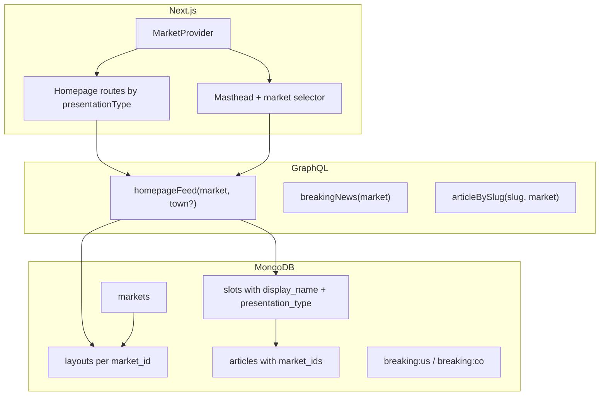
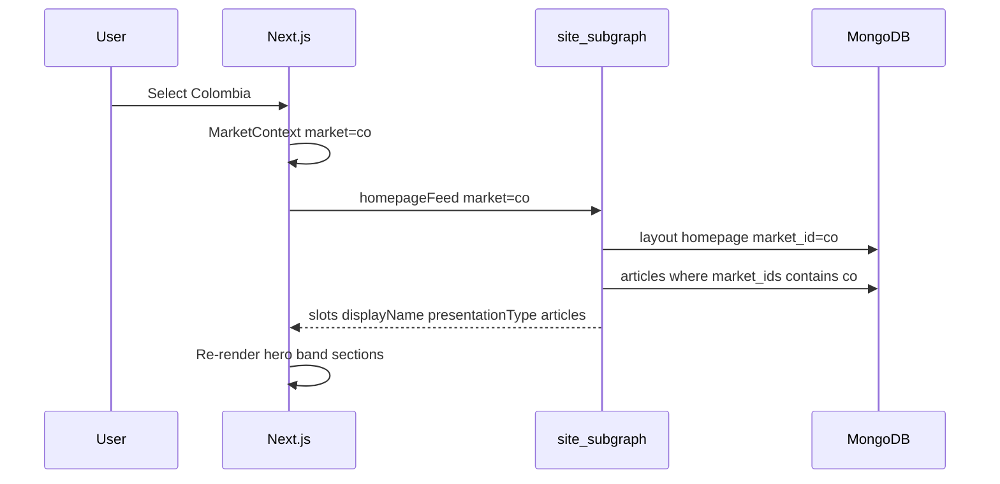

# Multi-market homepage plan

Standalone implementation plan for country- and town-aware news editions (e.g. USA vs Colombia). When a user switches market, the entire homepage—hero, sections, breaking ticker, and articles—comes from that market’s layout and content pool.

**Related:** [GRAPHQL.md](./GRAPHQL.md) (federation overview), prior architecture evaluation (Cursor plan: multi-market architecture eval).

---

## Goals

| Requirement | Phase 1 (this plan) | Later |
|-------------|---------------------|-------|
| User in USA sees USA news only | Yes | — |
| User in Colombia sees Colombia news only | Yes | — |
| Switching country reloads all homepage content | Yes | — |
| Editors can update content per market | Seed + layout_admin (market on layout) | Full admin UI |
| Local town editions | Optional `town` query arg + `town_id` on articles | Town filter or per-town layouts |

**Design principle:** Market and layout rules live in **Mongo + read layer**. The frontend renders **slots + presentation metadata**—not hardcoded `positionKey` names per country.

---

## Current state (baseline)

- Single global `homepage` layout; no `market_id` on layouts or articles.
- `homepageFeed` has no arguments; Redis key `graphql:homepageFeed` is global.
- [`homepage.tsx`](../frontend/components/features/homepage.tsx) routes slots by fixed keys (`hero`, `midterm-elections`, …).
- [`masthead.tsx`](../frontend/components/ui/masthead.tsx) and [`section-labels.ts`](../frontend/lib/helpers/section-labels.ts) hardcode US/CNN section nav.
- Breaking widget is one document: `_id: "breaking"`.

**Keep:** Slot-based layout, federated GraphQL, presentational components (`HomepageSection`, `HomepageStoryThumb`, editorial band).

---

## Target architecture



### Country switch sequence



---

## Data model

### `markets` collection

| Field | Type | Example |
|-------|------|---------|
| `_id` | string | UUID |
| `code` | string (unique) | `us`, `co` |
| `country` | string | `United States` |
| `label` | string | `USA` (UI selector) |
| `default_locale` | string | `en-US`, `es-CO` |

### `layouts` — add field

| Field | Type | Notes |
|-------|------|-------|
| `market_id` | string | Required for new layouts; unique active layout per `(market_id, page_name)` |

### `slots` — add fields

| Field | Type | Values |
|-------|------|--------|
| `display_name` | string | Section heading (e.g. `Política`, `US`) |
| `presentation_type` | string | See registry below |

**Presentation type registry** (`backend/shared/shared/core/markets.py`):

| `presentation_type` | UI component |
|---------------------|--------------|
| `hero` | `HeroBlock` |
| `editorial_lead` | Left column of `HomepageEditorialBand` |
| `editorial_spotlight` | Center column of editorial band |
| `rail_compact` | Right rail of editorial band |
| `grid_4` | `HomepageSection` (masthead nav uses these slots) |

Unknown types → fallback to `grid_4`.

### `articles` — add fields

| Field | Type | Notes |
|-------|------|-------|
| `market_ids` | string[] | Article visible in these markets |
| `town_id` | string \| null | Phase 2 local filter |

### `query_rule` (slot fill)

Always AND with `status: published` and `market_ids` containing current market.

```json
{ "category_id": "...", "limit": 4 }
```

Optional later: `town_id`, `tags`.

### Breaking widgets

| `_id` | Market |
|-------|--------|
| `breaking:us` | USA |
| `breaking:co` | Colombia |

---

## GraphQL API

### `homepageFeed`

```graphql
query HomepageFeed($market: String! = "us", $town: String) {
  homepageFeed(market: $market, town: $town) {
    layoutId
    pageName
    slots {
      id
      positionKey
      displayName
      presentationType
      contentType
      articles {
        id
        slug
        title
        authorName
        thumbnailUrl
        publishedAt
      }
    }
  }
}
```

### `breakingNews`

```graphql
query BreakingNews($market: String! = "us") {
  breakingNews(market: $market)
}
```

### `articleBySlug`

```graphql
query ArticleBySlug($slug: String!, $market: String! = "us") {
  articleBySlug(slug: $slug, market: $market) { ... }
}
```

### Cache keys (Redis)

```
graphql:homepageFeed:{market}:{town|_}   # TTL 15s
```

Invalidate pattern on seed/publish: `graphql:homepageFeed:*` plus legacy `graphql:homepageFeed`.

---

## Backend implementation checklist

### Phase 1 — Domain

| File | Action |
|------|--------|
| `backend/shared/shared/models/market.py` | **Create** `Market` model |
| `backend/shared/shared/core/markets.py` | **Create** constants: `DEFAULT_MARKET_CODE`, presentation types |
| `backend/shared/shared/models/layout.py` | Add `market_id` to `Layout`; `display_name`, `presentation_type` to `Slot` |
| `backend/shared/shared/models/article.py` | Add `market_ids`, `town_id` |
| `backend/shared/shared/read/collections.py` | Add `MARKETS_COLLECTION` |
| `backend/shared/shared/read/market_reads.py` | **Create** `get_market_by_code(db, code)` |

### Phase 2 — Reads

| File | Action |
|------|--------|
| `backend/shared/shared/read/layout_reads.py` | `get_active_layout(db, *, market_id, page_name)`; return slot metadata fields |
| `backend/shared/shared/read/site_reads.py` | `get_home_feed(db, *, market_code, town=None)`; filter articles by `market_ids`; `get_breaking(db, market_code)` |
| `backend/shared/shared/read/article_reads.py` | Scope `get_article_by_slug`, `list_category_articles`, `search_published` by `market_id` |
| `backend/shared/shared/read/article_reads.py` | `list_published_by_ids` — optional market filter for safety |

### Phase 3 — GraphQL subgraphs

| File | Action |
|------|--------|
| `backend/subgraphs/site_subgraph/site_subgraph/constants.py` | `homepage_feed_cache_key(market, town)` |
| `backend/subgraphs/site_subgraph/site_subgraph/types.py` | Args on resolvers; `HomepageSlot.display_name`, `presentation_type` |
| `backend/subgraphs/content_subgraph/content_subgraph/types.py` | `article_by_slug(..., market="us")` |
| `backend/subgraphs/layout_subgraph/layout_subgraph/types.py` | `active_homepage_layout(market="us")` (optional consistency) |

### Phase 4 — Seed

[`backend/admin_app/seed_dev.py`](../backend/admin_app/seed_dev.py):

1. Upsert markets `us` and `co`.
2. For each market, seed articles with `market_ids: [market_id]` and distinct titles (English vs Spanish).
3. Create one `homepage` layout per `market_id` with full slot specs.
4. Set each slot’s `display_name` and `presentation_type`.
5. Upsert `breaking:us` and `breaking:co`.
6. Clear Redis homepage feed cache keys.

**USA slot example (unchanged structure, add metadata):**

| order | position_key | presentation_type | display_name |
|-------|--------------|-------------------|--------------|
| 0 | hero | hero | Top Stories |
| 1 | more-top-stories | editorial_lead | More Top Stories |
| 2 | midterm-elections | editorial_spotlight | Midterm elections |
| 3 | editorial-rail | rail_compact | Featured |
| 4+ | politics, world, us, … | grid_4 | Per category |

**Colombia:** Same structure; Spanish `display_name` values; Colombia-specific demo headlines.

### Phase 5 — Tests & docs

| File | Action |
|------|--------|
| `backend/tests/test_graphql_integration.py` | Query `homepageFeed(market: "us")` and `"co"` |
| `docs/GRAPHQL.md` | Document market/town arguments and cache keys |

---

## Frontend implementation checklist

### Phase 1 — Market context

| File | Action |
|------|--------|
| `frontend/context/market-context.tsx` | **Create** `MarketProvider`, `useMarket()`, `MARKETS` list, `localStorage` key `newscore_market` |
| `frontend/app/providers.tsx` | Wrap with `MarketProvider` inside `ApolloProvider` |

### Phase 2 — GraphQL client

| File | Action |
|------|--------|
| `frontend/lib/graphql/operations.ts` | Add `$market` / `$town`; request `displayName`, `presentationType` |
| `frontend/interfaces/feed.ts` | Extend `IFeedSlot` |
| `frontend/lib/graphql/mappers.ts` | Map new fields |
| `frontend/hooks/use-feed.ts` | `variables: { market: marketCode, town }` from context |
| `frontend/hooks/use-breaking.ts` | `variables: { market }` |
| `frontend/hooks/use-article.ts` | `variables: { slug, market }` |

### Phase 3 — Rendering

| File | Action |
|------|--------|
| `frontend/components/features/homepage.tsx` | Find slots by `presentationType`; remove `positionKey` special cases |
| `frontend/components/features/homepage-section.tsx` | `slot.displayName ?? sectionLabel(slot.positionKey)` |
| `frontend/components/features/homepage-editorial-band.tsx` | Column titles from `displayName`; accept slots by type |
| `frontend/components/ui/masthead.tsx` | Market `<select>`; nav links from feed slots where `presentationType === 'grid_4'` |

### Phase 4 — Article page

| File | Action |
|------|--------|
| `frontend/app/article/[slug]/page.tsx` | Ensure `useArticle` receives market from context |

---

## Town (phase 2 — out of scope for initial ship)

| Approach | When to use |
|----------|-------------|
| **Filter** | Same country layout; `town` narrows articles with matching `town_id` |
| **Edition** | Separate layout per town (only if nav/modules differ) |

GraphQL already reserves `town` on `homepageFeed` for filter-only phase 2.

---

## Admin (phase 2 — optional follow-up)

- `layout_admin_app`: `market_id` on layout create; slot `display_name` / `presentation_type` on slot create/update.
- Validate `query_rule` with Pydantic schema.
- Invalidate `graphql:homepageFeed:{market}:*` on slot/article publish.

---

## Verification

### After seed

```bash
docker compose exec admin_app python seed_dev.py
```

### GraphQL

```bash
# USA — English headlines
curl -s http://localhost:4000/graphql -H "Content-Type: application/json" \
  -d '{"query":"{ homepageFeed(market: \"us\") { slots { displayName presentationType articles { title } } } }"}'

# Colombia — different headlines
curl -s http://localhost:4000/graphql -H "Content-Type: application/json" \
  -d '{"query":"{ homepageFeed(market: \"co\") { slots { displayName articles { title } } } }"}'
```

### Frontend

1. Open `/`.
2. Use masthead market selector: **USA** → US demo stories.
3. Switch to **Colombia** → all modules refresh with Colombia content.
4. Open an article slug from Colombia feed → detail loads with `market=co`.

### Cache clear (if stale)

```bash
docker compose exec redis redis-cli KEYS "graphql:homepageFeed:*"
docker compose exec redis redis-cli DEL graphql:homepageFeed
```

---

## Implementation todos

- [x] **domain-market** — Market model; `market_id` on layouts; `market_ids` on articles; seed USA + Colombia
- [x] **api-scoped-feed** — `homepageFeed(market, town?)`, `breakingNews(market)`; scoped Redis keys
- [x] **slot-metadata** — `displayName`, `presentationType` on slots and GraphQL
- [x] **fe-market-context** — `MarketProvider`; hooks pass `market`; refetch on change
- [x] **fe-generic-router** — Homepage by `presentationType`; dynamic masthead from feed
- [x] **article-scope** — `articleBySlug(slug, market)`; category/search filters
- [x] **docs-tests** — Update `GRAPHQL.md`; integration test for both markets

---

## Execution

Run in **Agent** mode with: *Execute the multi-market plan* (this document).

Do not duplicate country-specific React components—one homepage, many markets driven by data.
