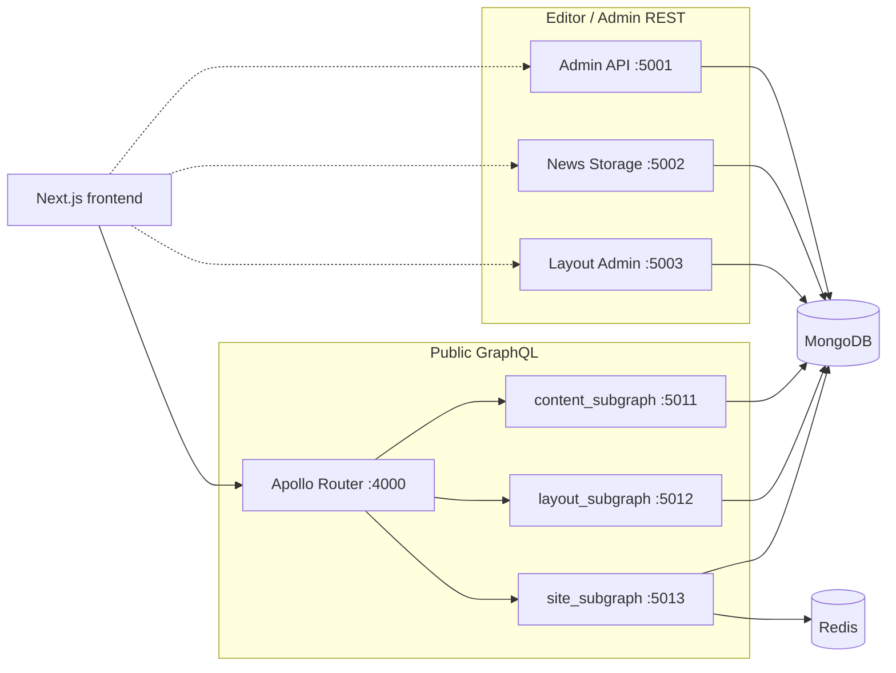

# Backend services

NewsCore runs **three REST editorial APIs**, a **federated GraphQL stack** for public reads, and a shared Python package. All services use MongoDB (`newscore`) and [`backend/shared/`](../backend/shared/).

## Quick reference

| Service | Port | Main responsibility | Auth |
|---------|------|---------------------|------|
| Admin | 5001 | Users, roles, login, audit | Issues JWT |
| News Storage | 5002 | Articles, media, categories, tags | JWT (reporter/editor) |
| Layout Admin | 5003 | Layouts, slots, widgets | JWT (editor) |
| Apollo Router | 4000 | Federated public GraphQL | None (public) |
| content_subgraph | 5011 | `Article` entity, slug/search/category | None |
| layout_subgraph | 5012 | `Layout`, `Slot` | None |
| site_subgraph | 5013 | `homepageFeed`, `breakingNews` | None |

**GraphQL:** `http://localhost:4000/graphql` — see [graphql-federation-plan.md](graphql-federation-plan.md)

**REST docs:** `http://localhost:5001/docs` … `5003/docs`

**Via Nginx:** `/graphql`, `/api/admin/`, `/api/news/`, `/api/layout/`

---

## GraphQL federation (public site)

The frontend loads news via **Apollo Client** → **Apollo Router** → three **Strawberry** subgraphs. Resolvers use [`backend/shared/shared/read/`](../backend/shared/shared/read/) (MongoDB directly, no REST hops).

| Subgraph | Key types / queries |
|----------|---------------------|
| content | `Article`, `articleBySlug`, `searchArticles`, `categoryArticles` |
| layout | `Layout`, `Slot`, `activeHomepageLayout` |
| site | `homepageFeed`, `breakingNews` (feed cached in Redis) |

**Deprecated:** Delivery REST on port 5004 (removed from Compose).

---

## REST editorial APIs

### Admin API (`admin_app`) — port 5001

Identity and administration: JWT login, users, reporters, roles, audit logs.

### News Storage API (`news_storage_app`) — port 5002

Articles, media, categories, tags, editorial search.

### Layout Admin API (`layout_admin_app`) — port 5003

Page layouts, slots, widgets for homepage composition.

---

## Shared infrastructure

| Piece | Role |
|-------|------|
| `backend/shared/` | DB, JWT, schemas, `read/` layer, Redis cache helpers |
| **MongoDB** | Single `newscore` database |
| **Redis** | Homepage feed cache (`site_subgraph`) |
| **Nginx** | Reverse proxy |

---

## End-to-end content flow

1. Log in via Admin API (`POST /auth/login`).
2. Create and publish content via News Storage API.
3. Configure homepage via Layout Admin API.
4. Public site reads data via GraphQL (`homepageFeed`, `articleBySlug`, etc.).

See [README](../README.md) for quickstart and seeding.
