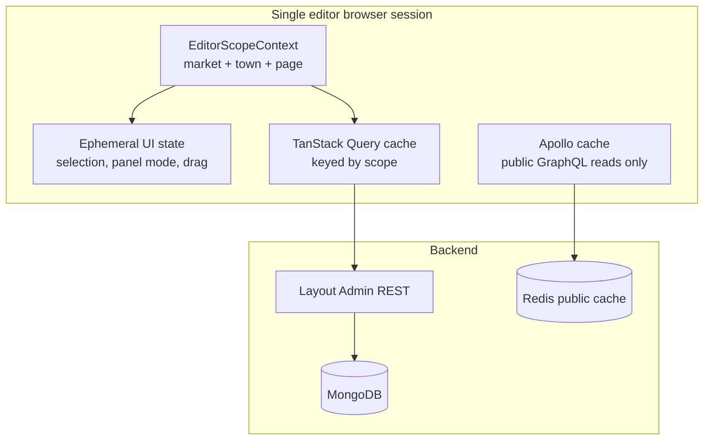

# Editorial state management — architecture reference

Decision record for client-side state in the admin editorial workflow (Reporter, Editor, Preview). Evaluates Redux and alternatives against current implementation and full-scale targets (~100 country editors, 1000+ town landing pages).

**Related:** [MULTI_MARKET_PLAN.md](./MULTI_MARKET_PLAN.md), [ARCHITECTURE_IMPLEMENTATION_PLAN.md](./ARCHITECTURE_IMPLEMENTATION_PLAN.md), [.cursor/plans/editor-canvas-preview.md](../.cursor/plans/editor-canvas-preview.md)

**Status:** Accepted direction (Jun 2026). Revisit when adding real-time collaboration, offline staging, or undo/redo across mutations.

---

## Executive summary

| Question | Answer |
|----------|--------|
| Is Redux a good fit for editor canvas / preview? | **No** — not classic Redux for UI state |
| Is global client state needed at all? | **Yes** — but scoped and mostly **server-state cache** |
| Recommended stack | **TanStack Query** (or RTK Query) for admin REST + **local hooks/context** for ephemeral UI |
| What scales to 100 editors / 1000 towns? | Backend multi-tenancy, keyed API cache, editor scope — not a single Redux store |

---

## Scale reframing

Two different problems are often conflated:

| Dimension | What it means | Where it lives |
|-----------|---------------|----------------|
| **~100 editors** | Concurrent browser sessions; each edits **one scope** at a time | Backend auth, API throughput, per-session client cache |
| **~100 country homepages** | ~100 layout documents | MongoDB + Redis (public reads) |
| **1000+ town landing pages** | Many layout/feed combinations, loaded **on demand** | MongoDB + keyed client/server cache |

A single editor never needs all countries or all towns in memory. They need one active **editor scope** with fast switching and correct invalidation after publish.

```
EditorScope = { marketCode, townId | null, pageName }
```

---

## Current implementation (baseline)

### Public site reads

- **Apollo Client** + GraphQL: `homepageFeed(market, town, pageName)`
- **MarketContext**: `marketCode`, `town` for visitor edition switching
- **Redis** cache keys include market + town + page

### Admin editorial writes

- **REST** via `layout-client.ts`, `apiFetch` — no query cache layer
- **Local `useState`** in route pages (`editor/page.tsx`, `reporter/page.tsx`, `preview/page.tsx`)
- **EditorialPreviewSyncContext** + `editorial-preview-events.ts`: cross-route/tab **stale signal** only (not shared feed data)
- Editor still defaults to `market = 'us'`, `page_name = 'homepage'`; no town in admin APIs yet

### Gap vs full scale

| Layer | Multi-market ready? | Notes |
|-------|---------------------|-------|
| Public GraphQL feed | Partial | `market`, `town`, `pageName` supported |
| Layout model | Partial | `market_id` on `Layout`; no `town_id` yet |
| `get_active_layout()` | Partial | `market_id + page_name` only |
| Admin editor UI | No | Hardcoded US homepage |
| User roles | No | Global `admin` / `editor` / `reporter`; no market/town scope on JWT |
| `IMPLEMENTATION_PLAN.md` | Planned | Lists React Query; not yet in `package.json` |

---

## Why classic Redux is not the right default

### What Redux solves well

- Deep prop drilling across unrelated components
- Shared **mutable client-owned** state updated from many places
- Complex coordinated updates (undo/redo, offline queues, action replay)
- Time-travel debugging of client actions

### Why that does not match this project

1. **State is server-derived** — slots, articles, placements, preview feed come from REST/Mongo. Redux would mostly mirror fetched data and fight invalidation.
2. **Shallow component tree** — `EditorPage` → pool / canvas / preview / detail panel. Little prop-drilling pain.
3. **Cross-route need is small** — Editor and Preview need **invalidation**, not a shared in-memory store (already solved with stale token + refetch).
4. **Split transport** — Apollo owns public GraphQL cache; adding Redux creates a third cache unless admin REST is unified.
5. **100 editors ≠ 100 stores** — each browser session is independent; concurrency is a backend concern.

### When to reconsider Redux (RTK + RTK Query)

- Offline or batched staging across many slots/pages with rollback
- Undo/redo over placement mutations
- Real-time collaboration on the same layout
- Unified middleware / audit of every client-side editorial action

None of these are required for canvas/preview phase 1 or for independent editors per market.

---

## Recommended architecture

### Two-layer client model



### Layer A — Server state (priority)

Use **TanStack Query** (matches `IMPLEMENTATION_PLAN.md`) or **RTK Query** for all admin REST.

**Conceptual query keys:**

```ts
['layout', marketCode, pageName]
['slots', layoutId]
['previewFeed', marketCode, townId, pageName]
['articles', marketCode, townId, filters]
['placements', marketCode, pageName]
```

**Benefits at scale:**

- Deduplication when multiple components request the same scope
- Stale-while-revalidate when switching market/town
- Targeted `invalidateQueries` after drop, publish, media save
- Recent scopes stay cached for fast back-navigation
- No manual sync of REST responses into normalized slices

**Do not** preload 1000 town layouts into a global store. Lazy-load on scope selection; use search/autocomplete for town picker.

### Layer B — Ephemeral UI state (small)

Keep local per session:

- `panelMode`: `'placement' | 'preview'`
- `selectedArticleId`, drag state, form drafts
- Optimistic overlay during placement drop (short-lived)

**Fit:** colocated hooks (`useEditorWorkspace`), optional `useReducer`, or small Zustand slice — not Redux.

### Layer C — Cross-route sync (existing pattern)

Keep `EditorialPreviewSyncContext` + broadcast channel. Optional extension: include `scope` in stale events so Preview invalidates the correct query key.

---

## Comparison matrix

| Approach | Canvas/preview today | 100 editors / 1000 towns |
|----------|----------------------|---------------------------|
| `useState` + `apiFetch` per page | Works for single US homepage | Breaks on scope switching; duplicate fetches |
| Redux Toolkit slices only | More structure | Still hand-roll fetch/cache/invalidation |
| **TanStack Query** | Recommended next step | Strong fit for scoped admin REST |
| **RTK Query** | Alternative | Same benefits; Redux DevTools if desired |
| Full Redux for UI + server | Overkill | Duplicates Apollo; heavy boilerplate |
| Apollo for admin REST | Awkward | Admin is REST; public is GraphQL |

---

## Backend prerequisites (not solved by frontend store)

Before town editors work end-to-end:

1. **`town_id` on layouts** (or inheritance: country layout → town overrides)
2. **Scoped layout resolution** — `get_active_layout(market_id, page_name, town_id?)`
3. **Editor authorization** — JWT or user record: `allowed_markets`, optional `allowed_towns`
4. **Admin API parameters** — all layout/placement/preview endpoints accept `market`, `town`, `page_name`
5. **Cache invalidation** — Redis keys per scope on publish (public path already keyed)

---

## Implementation roadmap

Ordered for incremental delivery without blocking current US homepage editor.

### Phase 1 — Foundation (do before multi-town UI)

1. Add **TanStack Query** to `frontend/package.json`; wrap admin routes in `QueryClientProvider`
2. Introduce **`EditorScopeContext`** — `{ marketCode, townId, pageName }` from JWT + picker
3. Migrate `layout-client` consumers to query hooks with scope in query keys
4. Replace duplicated preview fetch (`editor/page.tsx` + `use-homepage-preview-feed.ts`) with one `useEditorPreviewFeed(scope)` hook
5. Invalidate preview/placement queries on `notifyEditorialPreviewStale()` (pass scope when known)

### Phase 2 — Multi-market editor

1. Market picker in admin (or auto-scope from JWT)
2. Thread `marketCode` through all editor fetches/mutations (remove hardcoded `'us'`)
3. Backend: editor role scoped to market on API routes

### Phase 3 — Town landing pages

1. Backend layout model + resolution for `town_id`
2. Town search/picker in editor (virtualized list; do not load 1000 towns into memory)
3. Query keys include `townId`; lazy fetch on selection

### Phase 4 — Only if product requires it

- RTK Query migration if team standardizes on Redux Toolkit
- Optimistic mutation middleware, undo stack, or collaboration layer

---

## Hook sketch (reference)

```ts
// lib/editor/query-keys.ts
export const editorKeys = {
  all: ['editor'] as const,
  layout: (scope: EditorScope) =>
    [...editorKeys.all, 'layout', scope.marketCode, scope.pageName] as const,
  slots: (layoutId: string) =>
    [...editorKeys.all, 'slots', layoutId] as const,
  previewFeed: (scope: EditorScope) =>
    [...editorKeys.all, 'previewFeed', scope.marketCode, scope.townId, scope.pageName] as const,
  placements: (scope: EditorScope) =>
    [...editorKeys.all, 'placements', scope.marketCode, scope.pageName] as const,
}

// hooks/use-editor-preview-feed.ts
export function useEditorPreviewFeed(scope: EditorScope, enabled: boolean) {
  return useQuery({
    queryKey: editorKeys.previewFeed(scope),
    queryFn: () => getHomepagePreviewFeed(scope.marketCode, scope.townId, scope.pageName),
    enabled,
  })
}
```

After `patchSlotDraftPinnedIds` or publish:

```ts
queryClient.invalidateQueries({ queryKey: editorKeys.previewFeed(scope) })
queryClient.invalidateQueries({ queryKey: editorKeys.placements(scope) })
```

---

## Anti-patterns to avoid

- Putting all town layouts in a global Redux store at app init
- One undifferentiated `previewFeed` state without market/town/page in the key
- Duplicating Apollo’s job for public homepage reads in Redux
- Adding Redux before `EditorScope` exists on backend and frontend
- Sharing editor state across users (each session is isolated by design)

---

## Decision log

| Date | Decision | Rationale |
|------|----------|-----------|
| Jun 2026 | No classic Redux for editor | Server-derived state, shallow tree, stale-signal pattern sufficient for phase 1 |
| Jun 2026 | Prefer TanStack Query for admin REST | Aligns with `IMPLEMENTATION_PLAN.md`; keyed cache scales to multi-market/town |
| Jun 2026 | Keep ephemeral UI in hooks/context | Selection and panel mode are session-local, not global |
| Jun 2026 | Revisit RTK Query if Redux ecosystem required | Same server-state benefits with optional Redux middleware later |

---

## Files to touch when implementing

| Area | Current files |
|------|----------------|
| Editor page state | `frontend/app/(admin)/admin/editor/page.tsx` |
| Preview page | `frontend/app/(admin)/admin/preview/page.tsx`, `frontend/hooks/use-homepage-preview-feed.ts` |
| Stale sync | `frontend/context/editorial-preview-sync-context.tsx`, `frontend/lib/helpers/editorial-preview-events.ts` |
| Layout API | `frontend/lib/api/layout-client.ts` |
| Public feed (unchanged pattern) | `frontend/hooks/use-feed.ts`, `frontend/hooks/use-page-feed.ts` |
| Backend layout resolution | `backend/shared/shared/read/layout_reads.py`, `backend/shared/shared/models/layout.py` |
| Admin layout routes | `backend/layout_admin_app/layout_admin_app/routers/layouts.py` |
