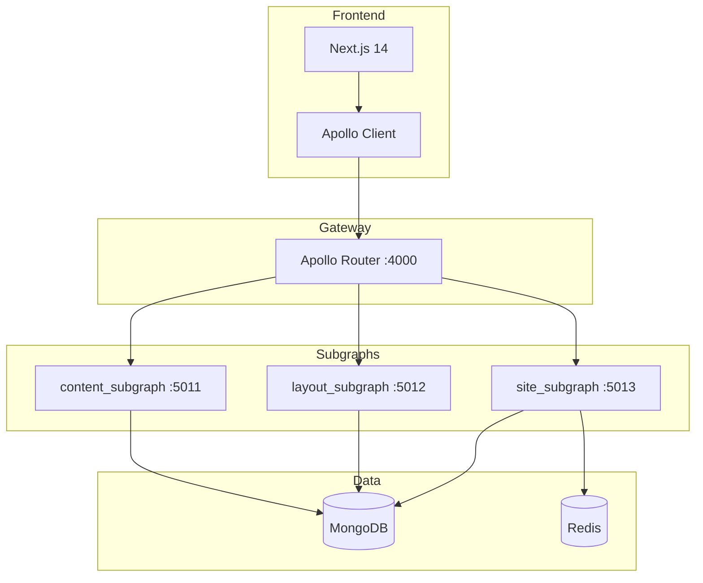

# GraphQL Federation Architecture

NewsCore public reads are served by **Apollo Federation 2** with three Strawberry subgraphs and an **Apollo Router** gateway. Editorial APIs remain REST.

## Architecture



## Services

| Service | Port | Role |
|---------|------|------|
| `graphql_router` | 4000 | Composes supergraph; public `/graphql` |
| `content_subgraph` | 5011 | `Article` entity, slug/search/category queries |
| `layout_subgraph` | 5012 | `Layout`, `Slot`, `activeHomepageLayout` |
| `site_subgraph` | 5013 | `homepageFeed`, `breakingNews` (Redis-cached feed) |

## Environment

| Variable | Example | Used by |
|----------|---------|---------|
| `MONGO_URI` | `mongodb://mongodb:27017` | All subgraphs |
| `MONGO_DB_NAME` | `newscore` | All subgraphs |
| `REDIS_URL` | `redis://redis:6379` | `site_subgraph` |
| `NEXT_PUBLIC_GRAPHQL_URL` | `http://localhost:4000/graphql` | Frontend |

Via Nginx: `http://localhost/graphql`

## Shared read layer

Mongo access for public reads lives in [`backend/shared/shared/read/`](../backend/shared/shared/read/):

- `article_reads.py` — published articles, search, categories
- `layout_reads.py` — active homepage layout metadata
- `site_reads.py` — homepage feed assembly, breaking widget
- `loaders.py` — batched author name loading

Subgraphs call this layer directly (no REST between services).

## Example queries

### Homepage feed

```graphql
query HomepageFeed {
  homepageFeed {
    layoutId
    pageName
    slots {
      id
      positionKey
      contentType
      articles {
        id
        slug
        title
        authorName
        thumbnailUrl
        publishedAt
      }
    }
  }
}
```

### Article by slug

```graphql
query ArticleBySlug($slug: String!) {
  articleBySlug(slug: $slug) {
    id
    title
    body
    authorName
    publishedAt
  }
}
```

## Local development

```bash
docker compose up --build
```

1. Subgraphs start and expose `/graphql` and `/health`.
2. `graphql_router` waits for health, runs `rover supergraph compose`, starts Apollo Router.
3. Frontend uses `NEXT_PUBLIC_GRAPHQL_URL`.

Recompose supergraph manually:

```bash
./scripts/compose-supergraph.sh
```

## Frontend

- Apollo Client: [`frontend/lib/graphql/apollo-client.ts`](../frontend/lib/graphql/apollo-client.ts)
- Operations: [`frontend/lib/graphql/operations.ts`](../frontend/lib/graphql/operations.ts)
- Optional codegen: `cd frontend && npm run codegen`

## Migration notes

- **Delivery REST (`:5004`)** is deprecated and removed from Docker Compose.
- Admin / News Storage / Layout Admin remain REST on 5001–5003.
- Cache keys for homepage feed: `graphql:homepageFeed` (15s TTL).

## Testing

```bash
cd backend/shared && pip install -e . && pytest ../tests/test_read_layer.py -q
```

With stack running:

```bash
curl -s -X POST http://localhost:4000/graphql \
  -H "Content-Type: application/json" \
  -d '{"query":"{ homepageFeed { pageName slots { id articles { title slug } } } } }"}'
```
